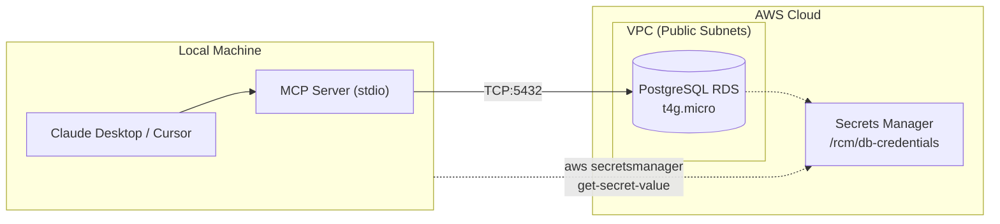
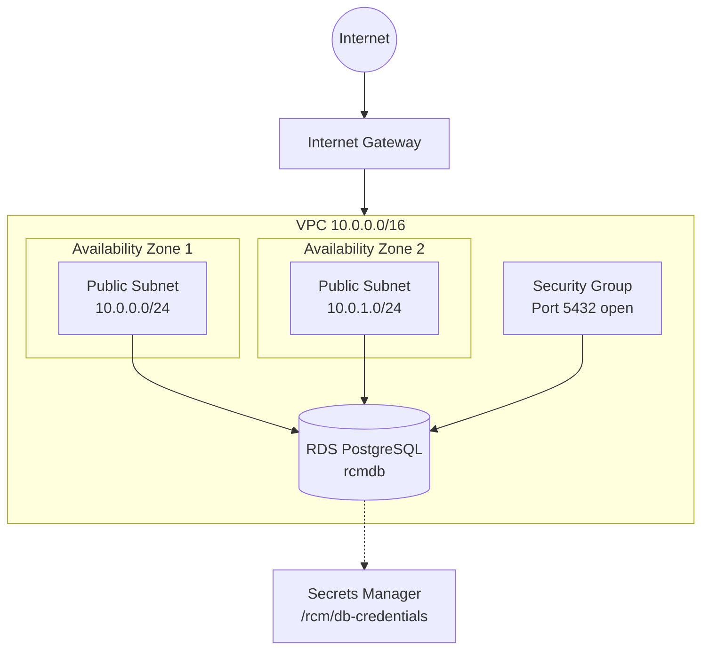

# Infrastructure Deployment

AWS CDK infrastructure for the Revenue Cycle Management application.

## Table of Contents

- [Architecture](#architecture)
- [What Gets Deployed](#what-gets-deployed)
- [Prerequisites](#prerequisites)
- [Deploying](#deploying)
- [Post-Deployment Setup](#post-deployment-setup)
- [Tearing Down](#tearing-down)
- [Troubleshooting](#troubleshooting)

## Architecture

This package deploys a **PostgreSQL RDS instance** for the RCM MCP server. The MCP server runs locally on your machine and connects to this remote database.



## What Gets Deployed

| Resource | Description | Cost Estimate |
|----------|-------------|---------------|
| VPC | Public subnets in 2 AZs | Free |
| RDS PostgreSQL | t4g.micro, 20GB storage | ~$15/month |
| Secrets Manager | Database credentials at `/rcm/db-credentials` | ~$0.40/month |

**Total: ~$15-16/month**



## Prerequisites

- AWS CLI configured with appropriate credentials
- Node.js 20+
- AWS CDK CLI (`npm install -g aws-cdk`)

## Deploying

```bash
# Build the package
yarn workspace @rcm/infrastructure build

# Preview changes
yarn workspace @rcm/infrastructure diff

# Deploy to AWS
yarn workspace @rcm/infrastructure deploy
```

## Post-Deployment Setup

After deployment, all connection details are stored in Secrets Manager at `/rcm/db-credentials`.

### 1. Get Database Credentials

```bash
# Get all connection details
aws secretsmanager get-secret-value \
  --secret-id /rcm/db-credentials \
  --query SecretString \
  --output text | jq .
```

Output:
```json
{
  "host": "rcmstack-xxx.region.rds.amazonaws.com",
  "port": 5432,
  "dbname": "rcmdb",
  "username": "rcm_admin",
  "password": "<generated-password>",
  "connection_string": "postgresql://rcm_admin:<password>@<host>:5432/rcmdb"
}
```

### 2. Set DATABASE_URL

```bash
# Get the connection string directly
export DATABASE_URL=$(aws secretsmanager get-secret-value \
  --secret-id /rcm/db-credentials \
  --query SecretString \
  --output text | jq -r .connection_string)

echo $DATABASE_URL
```

Or add to `packages/mcp-server/.env`:
```bash
# Generate the .env file
echo "DATABASE_URL=$(aws secretsmanager get-secret-value \
  --secret-id /rcm/db-credentials \
  --query SecretString \
  --output text | jq -r .connection_string)" > packages/mcp-server/.env
```

### 3. Run Migrations

```bash
# Set DATABASE_URL for migrations
export DATABASE_URL=$(aws secretsmanager get-secret-value \
  --secret-id /rcm/db-credentials \
  --query SecretString \
  --output text | jq -r .connection_string)

# Run migrations
yarn workspace @rcm/migrations migrate:up

# Seed the database
yarn workspace @rcm/migrations seed
```

### 4. Start the MCP Server

```bash
yarn workspace @rcm/mcp-server start
# Output: RCM MCP Server v2.0 running on stdio (PostgreSQL connected)
```

## Tearing Down

To destroy all resources:

```bash
yarn workspace @rcm/infrastructure cdk destroy
```

## Security Notes

This is a **demo configuration** with the database publicly accessible. For production:

- Use private subnets with VPN or bastion host access
- Restrict security group to specific IP ranges
- Enable `deletionProtection: true`
- Use larger instance types (t4g.small or larger)
- Enable Multi-AZ for high availability
- Consider Aurora PostgreSQL for better scaling

## Troubleshooting

### Can't connect to database

1. Check security group allows your IP:
   ```bash
   curl ifconfig.me
   ```

2. Test connection:
   ```bash
   psql $DATABASE_URL -c "SELECT 1"
   ```

### CDK deployment fails

1. Ensure you have AWS credentials configured:
   ```bash
   aws sts get-caller-identity
   ```

2. Bootstrap CDK (first time only):
   ```bash
   cdk bootstrap aws://<ACCOUNT_ID>/<REGION>
   ```

### Secret not found

If the secret doesn't exist after deployment, check the CloudFormation events:
```bash
aws cloudformation describe-stack-events \
  --stack-name RcmStack \
  --query 'StackEvents[?ResourceStatus==`CREATE_FAILED`]'
```

## Full Documentation

For additional details, see the [Infrastructure README on GitHub](https://github.com/caverac/rcm/tree/main/packages/infrastructure).

## Next Steps

- **[Run Migrations](../migrations/setup.md)** - Set up database schema
- **[MCP Server](../mcp-server/overview.md)** - Connect to production database
