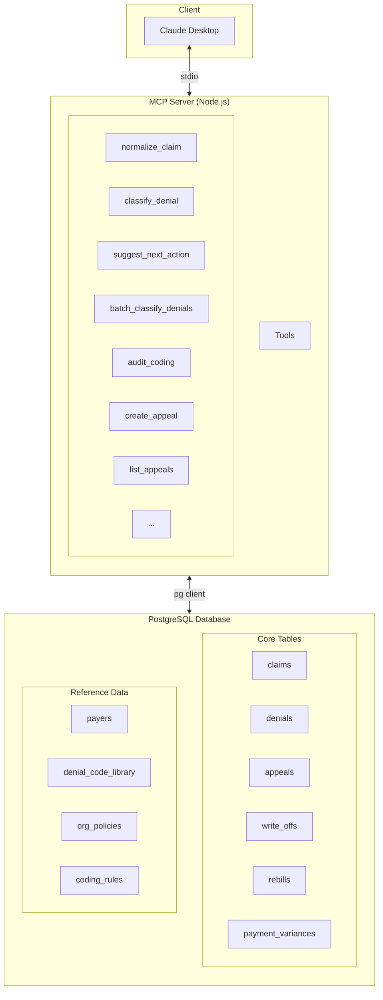
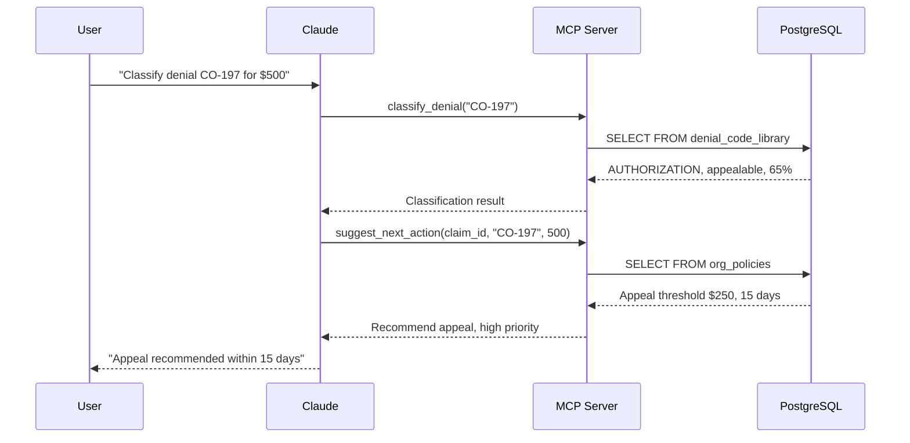

# MCP Server

Model Context Protocol (MCP) server for Revenue Cycle Management operations.

## Overview

The RCM MCP Server provides AI-powered tools for managing the complete healthcare revenue cycle through the [Model Context Protocol](https://modelcontextprotocol.io/). It enables AI assistants like Claude to help with:

- **Denial triage** - Classify denials and get policy-based recommendations
- **Cash leakage analysis** - Identify patterns and recovery opportunities
- **Pre-submission validation** - Catch coding errors before claims are submitted
- **Appeals management** - Track appeal lifecycle and success rates
- **Write-off tracking** - Monitor preventable write-offs
- **Rebill workflows** - Track corrections and recovery
- **Payment variance detection** - Identify underpayments by payer

## Setup

### Prerequisites

- Node.js 20+
- PostgreSQL database (see [Database Migrations](/docs/migrations/setup))
- Yarn 4.2.2 (managed via corepack)

### Build and Run

```bash
# Copy environment file
cp packages/mcp-server/.env.example packages/mcp-server/.env

# Build the server
yarn workspace @rcm/mcp-server build

# Start the server
yarn workspace @rcm/mcp-server start
```

For development with auto-rebuild:

```bash
yarn workspace @rcm/mcp-server dev
```

### Claude Desktop Integration

Add this configuration to your Claude Desktop config file:

**macOS:** `~/Library/Application Support/Claude/claude_desktop_config.json`

**Windows:** `%APPDATA%\Claude\claude_desktop_config.json`

```json
{
  "mcpServers": {
    "rcm": {
      "command": "node",
      "args": ["/absolute/path/to/rcm/packages/mcp-server/dist/index.js"]
    }
  }
}
```

After configuring, restart Claude Desktop and look for the MCP connection indicator.

**Test with seeded data:**

```
What denials do we have in the system? Classify them and suggest next actions.
```

## Available Tools

### Claims Management

| Tool | Description |
|------|-------------|
| `normalize_claim` | Normalize and validate claim data from various formats (837, 835, JSON) |
| `list_claims` | List claims with optional filters (patient, status) |
| `get_claim` | Retrieve claim details by ID |
| `update_claim_status` | Update claim status |

### Denial Classification

| Tool | Description |
|------|-------------|
| `classify_denial` | Classify denial code and get resolution guidance |
| `suggest_next_action` | Get policy-based recommendation (appeal, rebill, write-off) |
| `batch_classify_denials` | Analyze multiple denials for patterns and insights |
| `audit_coding` | Pre-submission coding validation |

### Appeals Management

| Tool | Description |
|------|-------------|
| `create_appeal` | Create appeal for a denied claim |
| `update_appeal` | Update appeal status, decision, payer response |
| `list_appeals` | Query appeals (status, priority, overdue, assignee) |
| `get_appeal_analytics` | Success rates, recovery metrics, insights |

### Write-offs

| Tool | Description |
|------|-------------|
| `create_write_off` | Write off uncollectible amount with preventability tracking |
| `list_write_offs` | Query write-offs (reason, category, preventability) |
| `get_write_off_analytics` | Preventable write-off analysis |

### Rebills

| Tool | Description |
|------|-------------|
| `create_rebill` | Create rebill after correcting denied claim |
| `update_rebill` | Update rebill status and resolution |
| `list_rebills` | Query rebills (status, reason, claim) |
| `get_rebill_analytics` | Success rates by correction type |

### Payment Variances

| Tool | Description |
|------|-------------|
| `create_payment_variance` | Track underpayments/overpayments |
| `update_payment_variance` | Update resolution, link to appeals |
| `list_payment_variances` | Query variances (type, payer, severity) |
| `get_payment_variance_analytics` | Payer patterns and contract compliance |

## Architecture



**Data Flow:**



For production deployment, see the [Infrastructure](/docs/infrastructure/deployment) package.

## Workflows

The MCP server supports several workflow patterns. See the detailed documentation for each:

- **[Denial Triage](/docs/workflows/denial-triage)** - Classify denials and get action recommendations
- **[Cash Leakage Analysis](/docs/workflows/cash-leakage)** - Identify denial patterns and revenue loss
- **[Pre-Submission Validation](/docs/workflows/coding-validation)** - Prevent denials before submission
- **[Appeals Management](/docs/workflows/appeals-management)** - Track appeal lifecycle
- **[Write-off Analysis](/docs/workflows/write-offs)** - Monitor preventable write-offs
- **[Rebilling Workflow](/docs/workflows/rebills)** - Track corrections and recovery
- **[Payment Variance Analysis](/docs/workflows/payment-variances)** - Detect underpayments

## Customization

### Add Organization Policies

```sql
INSERT INTO org_policies (policy_name, policy_type, min_amount, days_to_action, auto_appeal)
VALUES ('High Value Appeals', 'appeal_threshold', 1000.00, 10, true);
```

### Add Payer-Specific Rules

```sql
INSERT INTO org_policies (policy_name, policy_type, payer_id, denial_category, min_amount, auto_appeal)
VALUES ('BCBS Auth Denials', 'appeal_threshold',
        (SELECT id FROM payers WHERE payer_id = 'BCBS-CA-001'),
        'AUTHORIZATION', 200.00, true);
```

### Add Coding Rules

```sql
INSERT INTO coding_rules (rule_name, rule_type, cpt_code, required_modifier, error_message, severity)
VALUES ('Custom Modifier Rule', 'modifier_required', '12345', 'XX', 'Requires modifier XX', 'warning');
```

## Troubleshooting

### Server Not Appearing in Claude Desktop

1. Check the config file path is correct
2. Use absolute paths (not relative)
3. Verify the server builds: `yarn workspace @rcm/mcp-server build`
4. Check Claude Desktop logs

### Database Connection Issues

1. Verify PostgreSQL is running: `docker ps | grep postgres`
2. Check DATABASE_URL in `.env` file
3. Ensure migrations have run: `yarn workspace @rcm/migrations migrate:up`
4. Test connectivity: `psql $DATABASE_URL -c "SELECT 1"`

### Missing Reference Data

If `classify_denial` returns "unknown code":

1. Verify migrations ran: `yarn workspace @rcm/migrations migrate:up`
2. Check denial_code_library table has data
3. Run seed script: `yarn workspace @rcm/migrations seed`
