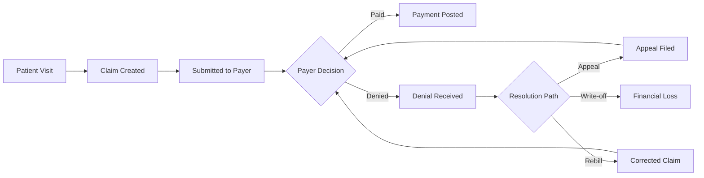
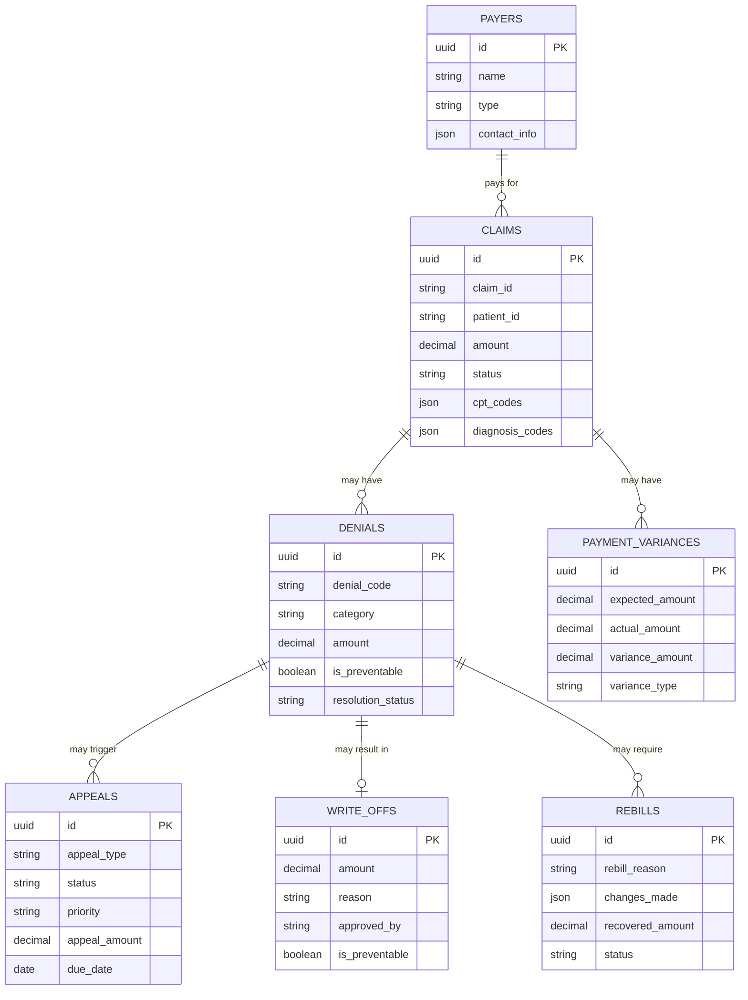
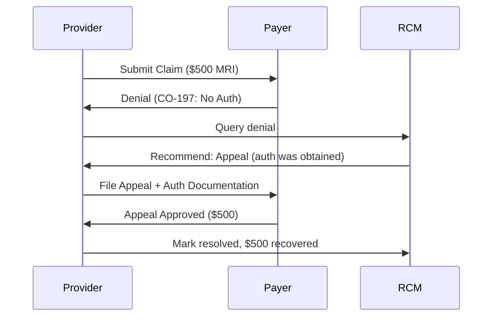

# Understanding the Revenue Cycle

Before diving into the RCM platform, it's important to understand what the healthcare revenue cycle is, why it's notoriously difficult to manage, and how automation can help.

## What is the Revenue Cycle?

The **revenue cycle** is the complete financial process healthcare providers use to get paid for services rendered. It starts when a patient schedules an appointment and ends when the final payment is collected.



### The Core Flow

1. **Service Delivery** - Patient receives care
2. **Claim Submission** - Provider bills the insurance payer
3. **Adjudication** - Payer processes and decides on the claim
4. **Payment or Denial** - Claim is paid, partially paid, or denied
5. **Resolution** - Denied claims are appealed, rebilled, or written off

## Why is Revenue Cycle Management Difficult?

Healthcare billing is one of the most complex domains in any industry. Here's why:

### 1. Regulatory Complexity

- **Thousands of billing codes** - CPT, ICD-10, HCPCS codes with specific rules
- **Payer-specific requirements** - Each insurance company has different policies
- **Frequent updates** - Codes and rules change annually
- **Compliance requirements** - HIPAA, CMS guidelines, state regulations

### 2. High Denial Rates

The average claim denial rate is **5-10%**, but for some specialties it exceeds 20%. Common denial reasons include:

| Category | Examples | Typical Resolution |
|----------|----------|-------------------|
| Authorization | Prior auth missing, referral required | Appeal with documentation |
| Coding Errors | Wrong modifier, bundling issues | Rebill with corrections |
| Medical Necessity | Service not deemed necessary | Appeal with clinical notes |
| Patient Responsibility | Deductible, non-covered service | Patient billing or write-off |

### 3. Revenue Leakage

**Cash leakage** occurs when legitimate revenue is lost due to:

- Denials that aren't worked or are worked too late
- Underpayments that go unnoticed
- Write-offs that could have been recovered
- Preventable errors that cause repeated denials

Studies estimate healthcare providers lose **3-5% of net revenue** to preventable billing issues.

### 4. Labor-Intensive Processes

Traditional revenue cycle management requires:

- **Manual research** - Looking up denial codes, payer policies, fee schedules
- **Case-by-case decisions** - Determining whether to appeal, rebill, or write off
- **Document gathering** - Collecting clinical notes, authorization forms, contracts
- **Follow-up tracking** - Managing appeal deadlines and resubmissions

A single denial can require 15-30 minutes of staff time to resolve.

## Why Automation Makes Sense

Given the complexity, automation through AI-powered tools provides significant advantages:

### Instant Classification

Instead of manual lookup, AI can instantly classify denials and recommend actions:

```
Input: "CO-197 denial for $500 MRI"

Output:
- Category: Authorization
- Recommended Action: Appeal (High Priority)
- Success Rate: 65%
- Deadline: 30 days from denial date
- Required Documents: Authorization form, clinical notes
```

### Policy-Driven Decisions

Organization policies can be encoded and applied automatically:

- Claims over $250 with authorization denials → Auto-escalate for appeal
- Claims under $25 → Write off (cost to pursue exceeds value)
- Coding errors → Route to rebill queue

### Pattern Detection

AI can identify systemic issues humans might miss:

- "Authorization denials from Payer X increased 40% this month"
- "CPT 99213 is being denied 3x more than average"
- "Dr. Smith's claims have 15% denial rate vs. 5% practice average"

### Natural Language Access

Instead of complex database queries or multiple system lookups, staff can simply ask:

> "Show me all unpaid authorization denials over $200 from the last 30 days"

## Core Entities in Revenue Cycle

The RCM platform models the revenue cycle through interconnected entities:



### Entity Descriptions

#### Payers
Insurance companies that reimburse healthcare providers. Each payer has unique policies, fee schedules, and submission requirements.

#### Claims
The fundamental unit of healthcare billing. A claim represents services provided to a patient, submitted to a payer for reimbursement. Contains procedure codes (CPT), diagnosis codes (ICD-10), and billing amounts.

#### Denials
When a payer refuses to pay a claim. Each denial has a standardized code (CO-197, PR-1, etc.) indicating the reason. Denials must be resolved through appeals, rebills, or write-offs.

#### Appeals
Formal requests asking payers to reconsider denied claims. Appeals require supporting documentation and must be filed within payer-specific deadlines (typically 30-180 days).

#### Write-offs
Decisions to stop pursuing payment, accepting the financial loss. Write-offs should be policy-driven (e.g., small balances below threshold) and tracked for preventability analysis.

#### Rebills
Corrected claims submitted after fixing errors identified in the original denial. Common corrections include adding modifiers, updating codes, or attaching missing documentation.

#### Payment Variances
Discrepancies between expected and actual payment amounts. Underpayments may indicate contract violations or incorrect fee schedule application.

## Data Flow Example

Here's how these entities connect in a real scenario:



## Next Steps

Now that you understand the revenue cycle fundamentals:

- **[Denial Triage Workflow](/docs/workflows/denial-triage)** - See how to classify and route denials
- **[Appeals Management](/docs/workflows/appeals-management)** - Learn the appeal process
- **[Cash Leakage Analysis](/docs/workflows/cash-leakage)** - Identify revenue recovery opportunities
