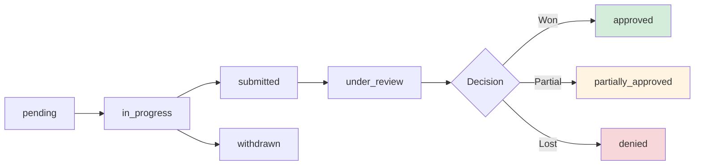

# Appeals Management

Track appeal lifecycle from filing to resolution with automatic status updates.

## Overview

When claims are denied, you may need to appeal the decision to recover revenue. This workflow provides tools to create, track, and analyze appeals.

## Tools Used

| Tool | Purpose |
|------|---------|
| `create_appeal` | Create appeal for a denied claim |
| `update_appeal` | Update status, decision, payer response |
| `list_appeals` | Query appeals with filters |
| `get_appeal_analytics` | Success rates and recovery metrics |

## Example: Working with Seeded Appeals

The database contains 2 seeded appeals:

| Appeal | Denial | Claim | Amount | Status | Priority |
|--------|--------|-------|--------|--------|----------|
| 850e8400...001 | CO-197 | CLM-2024-001235 | $500 | submitted | high |
| 850e8400...002 | CO-50 | CLM-2024-001235 | $500 | pending | medium |

### Check Appeal Status

**User prompt:**

```
Show me the status of our appeals and check if any are overdue.
```

**What happens:**

The `list_appeals` tool retrieves appeals from the database:

```json
{
  "appeals": [
    {
      "id": "850e8400-e29b-41d4-a716-446655440001",
      "denial_id": "750e8400-e29b-41d4-a716-446655440001",
      "claim_id": "650e8400-e29b-41d4-a716-446655440002",
      "appeal_type": "first_level",
      "status": "submitted",
      "priority": "high",
      "appeal_amount": 500.00,
      "filed_date": "2024-01-20",
      "due_date": "2024-02-20",
      "appeal_reason": "Authorization was obtained prior to service - see attached documentation",
      "assigned_to": "Jane Smith"
    },
    {
      "id": "850e8400-e29b-41d4-a716-446655440002",
      "appeal_type": "first_level",
      "status": "pending",
      "priority": "medium",
      "appeal_amount": 500.00,
      "due_date": "2024-02-25",
      "appeal_reason": "Medical necessity supported by clinical documentation - MRI indicated for persistent headaches",
      "assigned_to": "John Doe"
    }
  ],
  "total": 2
}
```

**Expected Response:**

> You have 2 appeals totaling $1,000:
>
> 1. **CO-197 Authorization Appeal** (High Priority)
>    - Status: Submitted on 1/20/2024
>    - Due: 2/20/2024
>    - Assigned to: Jane Smith
>    - Reason: Authorization documentation was obtained prior to service
>
> 2. **CO-50 Medical Necessity Appeal** (Medium Priority)
>    - Status: Pending (not yet submitted)
>    - Due: 2/25/2024
>    - Assigned to: John Doe
>    - Needs: Clinical documentation for MRI

### Update Appeal Decision

**User prompt:**

```
The first appeal was approved for $450. Update it.
```

**What happens:**

The `update_appeal` tool updates the appeal:

```json
{
  "appeal_id": "850e8400-e29b-41d4-a716-446655440001",
  "status": "approved",
  "decision_date": "2024-02-15",
  "approved_amount": 450.00,
  "payer_response": "Appeal approved. Authorization requirement waived."
}
```

**System automatically:**
- Updates denial resolution_status to "resolved"
- Sets denial recovered_amount to $450
- Updates claim status

## Appeal Lifecycle



## Appeal Analytics

**User prompt:**

```
How are our appeals performing?
```

The `get_appeal_analytics` tool returns:

```json
{
  "total_appeals": 2,
  "total_amount": 1000.00,
  "by_status": {
    "submitted": 1,
    "pending": 1
  },
  "by_priority": {
    "high": 1,
    "medium": 1
  },
  "overdue_count": 0,
  "insights": [
    "2 appeals in queue totaling $1,000",
    "1 high-priority appeal requires attention",
    "No overdue appeals"
  ]
}
```

## Best Practices

### Priority Assignment

- **High**: Amount over $500, timely filing deadline soon, strong documentation
- **Medium**: Amount $100-$500, reasonable timeframe
- **Low**: Amount under $100, low win probability

### Due Date Management

Set due dates based on payer timely filing limits:
- **First level**: Typically 180 days from denial
- **Second level**: 30-60 days from first level denial
- **External review**: 30 days from second level denial

**Tip:** Set due dates 15-30 days before actual deadline for buffer time.

## Next Steps

- **[Denial Triage](./denial-triage.md)** - Identify appealable denials
- **[Write-offs](./write-offs.md)** - Handle non-appealable denials
- **[Cash Leakage](./cash-leakage.md)** - Analyze appeal patterns
