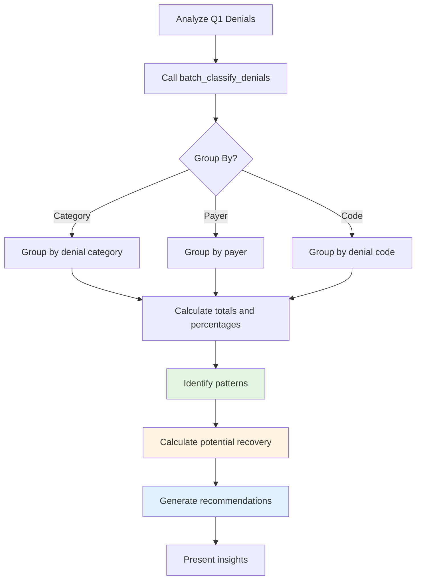

# Cash Leakage Analysis

Identify patterns of revenue loss across denials with AI-powered batch analysis.

## Overview

Cash leakage occurs when denials are left unworked or not appealed when viable. This workflow helps identify where money is being lost and provides actionable insights.

## Why Use AI?

- **Pattern Detection** - Analyzes hundreds of denials simultaneously
- **Intelligent Grouping** - Automatically categorizes by meaningful dimensions
- **ROI Optimization** - Distinguishes high-value vs. high-volume denials

## Workflow Diagram

## Example Analysis

**User Request:**

> "Analyze all denials from Q1 2024. Where are we losing the most money?"

**AI Response:**

> I've analyzed 847 denials totaling $287,450:
>
> **Top Revenue Loss by Category:**
>
> | Category          | Count | Amount  | %   | Appealable |
> | ----------------- | ----- | ------- | --- | ---------- |
> | Authorization     | 215   | $97,320 | 34% | ✅ 82%     |
> | Medical Necessity | 148   | $71,200 | 25% | ✅ 65%     |
> | Coding Error      | 186   | $52,680 | 18% | ✅ 91%     |
> | Timely Filing     | 98    | $41,650 | 14% | ❌ 5%      |
>
> **Key Findings:**
>
> 1. **Authorization = #1 Problem** ($97K, 82% appealable)
>    - Potential recovery: $51,700
>    - Root cause: Pre-service auth gaps
> 2. **Coding Errors = High-Confidence** ($52K, 91% appealable)
>    - Potential recovery: $40,300
>    - Preventable with validation
>
> **Recommended Actions:**
>
> - Appeal all auth denials >$250 (124 claims, $68K potential)
> - Implement coding validation (prevent 91% of coding denials)
>
> **Projected Annual Impact: $1.15M**

## Real-World Impact

### Discovery Example

One organization discovered 60% of authorization denials were for services that don't require authorization per contract. **Fix:** Created payer-specific auth requirement list. **Result:** 60% reduction ($780K annually).

### Prevention Example

45% of coding denials were missing modifier 25. **Fix:** Pre-submission validation. **Result:** 88% reduction ($340K annually).

## Next Steps

- **[Denial Triage](./denial-triage.md)** - Act on identified denials
- **[Coding Validation](./coding-validation.md)** - Prevent future denials
