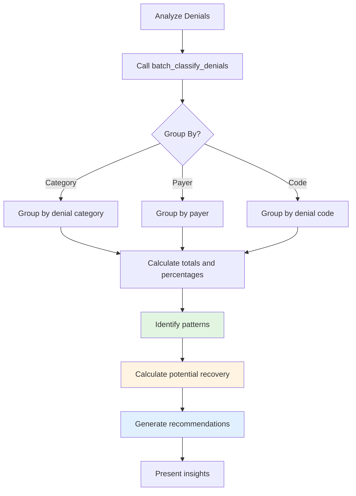

# Cash Leakage Analysis

Identify patterns of revenue loss across denials with AI-powered batch analysis.

## Overview

Cash leakage occurs when denials are left unworked or not appealed when viable. This workflow helps identify where money is being lost and provides actionable insights.

## Tools Used

| Tool | Purpose |
|------|---------|
| `batch_classify_denials` | Analyze multiple denials, group by category/payer/code |

## Example: Analyze Seeded Denials

The database contains 4 seeded denials. Let's analyze them for patterns.

**User prompt:**

```
Analyze all our denials and identify where we're losing money.
```

**What happens:**

The `batch_classify_denials` tool groups the seeded denials:

```json
{
  "total_denials": 4,
  "total_amount": 1265.00,
  "groups": [
    {
      "group_key": "AUTHORIZATION",
      "count": 1,
      "total_amount": 500.00,
      "percentage": 39.5,
      "avg_amount": 500.00,
      "top_codes": ["CO-197"]
    },
    {
      "group_key": "MEDICAL_NECESSITY",
      "count": 1,
      "total_amount": 500.00,
      "percentage": 39.5,
      "avg_amount": 500.00,
      "top_codes": ["CO-50"]
    },
    {
      "group_key": "CODING_ERROR",
      "count": 1,
      "total_amount": 250.00,
      "percentage": 19.8,
      "avg_amount": 250.00,
      "top_codes": ["CO-4"]
    },
    {
      "group_key": "PATIENT_RESPONSIBILITY",
      "count": 1,
      "total_amount": 15.00,
      "percentage": 1.2,
      "avg_amount": 15.00,
      "top_codes": ["PR-1"]
    }
  ],
  "insights": [
    "39% of denials ($500) are AUTHORIZATION issues - implement pre-service auth checks",
    "39% of denials ($500) are MEDICAL_NECESSITY - ensure clinical documentation supports services",
    "20% of denials ($250) are CODING_ERROR - pre-submission validation can prevent these"
  ]
}
```

**Expected Response:**

> Analysis of 4 denials totaling $1,265:
>
> | Category | Count | Amount | % | Action |
> |----------|-------|--------|---|--------|
> | Authorization | 1 | $500 | 40% | Appeal (CO-197 on CLM-2024-001235) |
> | Medical Necessity | 1 | $500 | 40% | Appeal with clinical documentation |
> | Coding Error | 1 | $250 | 20% | Already rebilled (CO-4) |
> | Patient Responsibility | 1 | $15 | 1% | Written off per policy |
>
> **Key Findings:**
> - 80% of denial dollars ($1,000) are appealable
> - The CO-4 coding error was preventable with modifier validation
> - $15 PR-1 correctly written off (below $25 threshold)

## Seeded Data Summary

| Denial | Claim | Amount | Status | Resolution |
|--------|-------|--------|--------|------------|
| CO-197 | CLM-2024-001235 | $500 | Appeal submitted | Pending |
| CO-50 | CLM-2024-001235 | $500 | Appeal pending | In progress |
| CO-4 | CLM-2024-001237 | $250 | Rebilled | Paid $200 |
| PR-1 | CLM-2024-001236 | $15 | Written off | Below threshold |

## Workflow Diagram



## Analytics Features

- **Grouping** - By category, payer, or denial code
- **Percentage breakdowns** - See where money is concentrated
- **Actionable insights** - Specific recommendations per pattern
- **Concentration risk** - Identifies if one payer/category dominates

## Next Steps

- **[Denial Triage](./denial-triage.md)** - Act on identified denials
- **[Coding Validation](./coding-validation.md)** - Prevent future coding errors
- **[Appeals Management](./appeals-management.md)** - Track appeal outcomes
