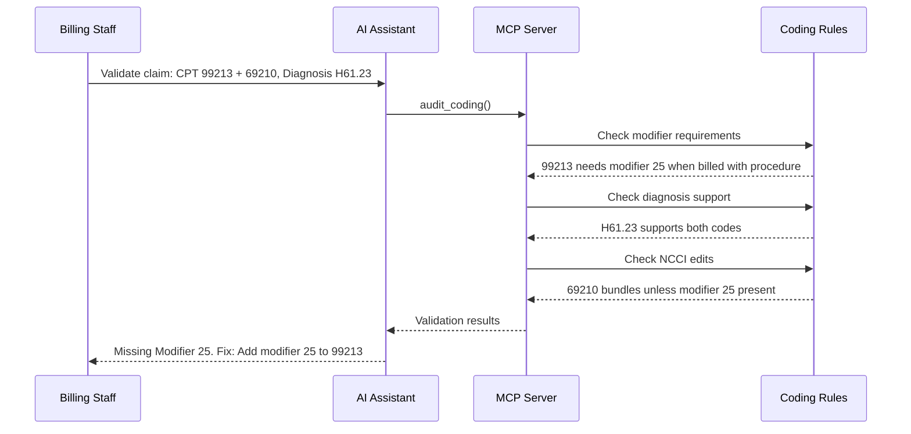

# Pre-Submission Coding Validation

Prevent denials before claim submission with AI-powered coding rule validation.

## Overview

Pre-submission validation catches errors before claims are sent to payers, preventing denials and improving first-pass payment rates.

## Why Use AI?

- **Complexity Management** - Knows thousands of NCCI edits and modifier rules
- **Speed** - Validates in less than 1 second vs 3-5 minutes manually
- **Prevention ROI** - Prevent 100 denials/month = $4,000 monthly savings

## Workflow Diagram

## Example Validation

**User:**

> "Check this claim: Patient visit for ear pain, exam (99213) and earwax removal (69210). Diagnosis H61.23."

**AI Response:**

> ⚠️ **Issue Found - Will Cause Denial**
>
> **Missing Modifier 25 on E/M Code**
>
> - CPT 99213 (E/M) + 69210 (procedure) on same day
> - Payer will bundle and deny the visit code
>
> **Fix:** Add modifier 25 to E/M:
>
> - Before: `99213, 69210`
> - After: `99213-25, 69210`
>
> **Expected Payment:**
>
> - 99213-25: ~$112
> - 69210: ~$47
> - Total: ~$159 ✅
>
> Without fix, you'd lose $47 per claim.

## Real-World Impact

| Metric                | Before AI | After AI | Improvement |
| --------------------- | --------- | -------- | ----------- |
| Coding denials        | 15%       | 2%       | -88%        |
| First-pass acceptance | 82%       | 95%      | +13%        |
| Days in AR            | 38        | 29       | -24%        |

**Annual Savings:** $1.35M (based on 10K claims/month)

## Common Errors Caught

| Error Type          | Impact         | Detection Rate | Example                          |
| ------------------- | -------------- | -------------- | -------------------------------- |
| Missing Modifier 25 | 40% of denials | 100%           | "99213 with procedure needs -25" |
| Invalid Dx Support  | 25% of denials | 98%            | "Z00.00 doesn't support 99213"   |
| NCCI Bundling       | 20% of denials | 99%            | "43239 bundles into 43235"       |

## Next Steps

- **[Denial Triage](./denial-triage.md)** - Handle denials that slip through
- **[Cash Leakage](./cash-leakage.md)** - Analyze coding error patterns
