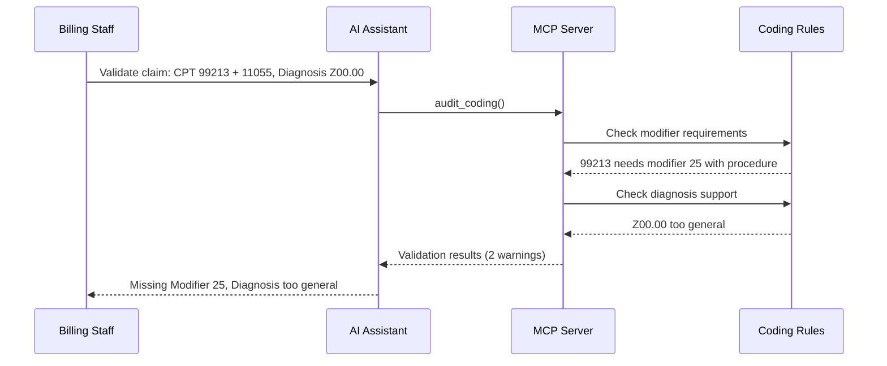

# Pre-Submission Coding Validation

Prevent denials before claim submission with AI-powered coding rule validation.

## Overview

Pre-submission validation catches errors before claims are sent to payers, preventing denials and improving first-pass payment rates.

## Tools Used

| Tool | Purpose |
|------|---------|
| `normalize_claim` | Validate claim format and required fields |
| `audit_coding` | Check CPT/diagnosis codes against coding rules |

## Example: Validate a New Claim

Before submitting a claim, validate it to catch potential denial causes.

**User prompt:**

```
Check this claim before I submit it: patient PAT-007, CPT codes 99213 and 11055, diagnosis Z00.00, amount $200
```

**What happens:**

The `audit_coding` tool checks against coding rules in the database:

```json
{
  "passed": false,
  "errors": [
    {
      "rule_name": "E/M with Procedure Same Day",
      "severity": "warning",
      "message": "E/M code 99213 billed on same day as procedure 11055 typically requires modifier 25",
      "cpt_code": "99213",
      "suggestion": "Add modifier 25 to E/M code"
    },
    {
      "rule_name": "Invalid Diagnosis Z00.00",
      "severity": "warning",
      "message": "Z00.00 is too general and may not support medical necessity",
      "suggestion": "Use more specific diagnosis code"
    }
  ],
  "summary": {
    "total_issues": 2,
    "errors": 0,
    "warnings": 2,
    "info": 0
  },
  "risk_level": "medium"
}
```

**Expected Response:**

> Found 2 issues before submission:
>
> 1. **Missing Modifier 25** - E/M code 99213 with procedure 11055 on same day requires modifier 25. Without it, the payer will bundle and deny the E/M.
>
> 2. **Diagnosis Too General** - Z00.00 is too general and may not support medical necessity. Use a more specific diagnosis code.
>
> **Fix these to avoid denials like the CO-4 we had on CLM-2024-001237** (which was denied for the same modifier issue).

## Seeded Coding Rules

The database includes these validation rules:

| Rule | Type | Trigger | Action |
|------|------|---------|--------|
| Modifier 25 Required | modifier_required | E/M + procedure same day | Add modifier 25 |
| Bilateral Modifier 50 | modifier_required | Bilateral procedures | Add modifier 50 |
| Invalid Z00.00 | diagnosis_support | Z00.00 used | Use specific diagnosis |
| Modifier 59 | modifier_required | Distinct procedures | Add modifier 59 |

## Real-World Prevention

The seeded rebill for CLM-2024-001237 shows what happens without validation:

1. **Original claim:** 99213 + 11102 (E/M + biopsy), no modifier
2. **Denial:** CO-4 (modifier error), $250 denied
3. **Rebill:** Added modifier 25 to 99213
4. **Result:** Paid $200 (recovered after rework)

With pre-submission validation, this denial would have been prevented.

## Workflow Diagram



## Common Errors Caught

| Error Type | Impact | Detection Rate | Example |
|------------|--------|----------------|---------|
| Missing Modifier 25 | 40% of coding denials | 100% | "99213 with procedure needs -25" |
| Invalid Dx Support | 25% of coding denials | 98% | "Z00.00 doesn't support 99213" |
| NCCI Bundling | 20% of coding denials | 99% | "43239 bundles into 43235" |

## Next Steps

- **[Denial Triage](./denial-triage.md)** - Handle denials that slip through
- **[Rebills](./rebills.md)** - Track corrections when validation is missed
- **[Cash Leakage](./cash-leakage.md)** - Analyze coding error patterns
