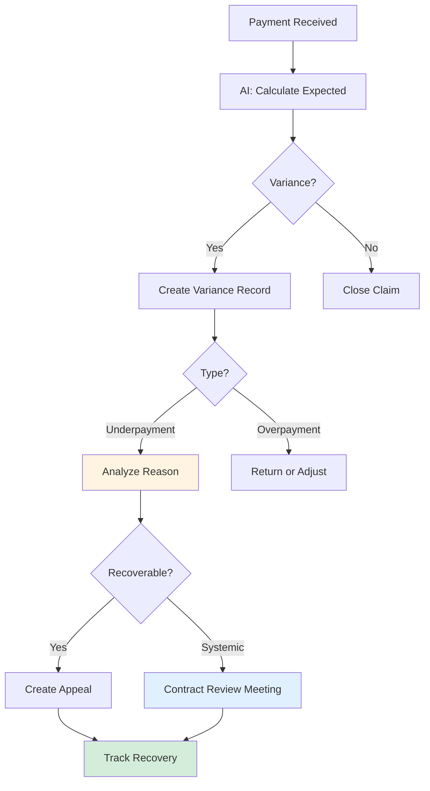

# Payment Variance Analysis

Detect and resolve discrepancies between expected and actual payments.

## Overview

Payment variances occur when payers pay different amounts than contracted rates. AI helps identify underpayments, overpayments, and patterns indicating contract compliance issues.

## Why Use AI?

- **Automatic Detection** - Calculates expected payment and flags variances
- **Pattern Recognition** - Identifies systematic underpayments by payer
- **Recovery Prioritization** - Ranks by probability and amount

## Workflow Diagram

## Example Detection

**AI Analysis:**

> **Payment Variance Detected**
>
> Claim: CLM-2024-001234
>
> - Expected payment: $500 (per 2024 contract)
> - Actual payment: $425
> - **Variance: -$75 (15% underpayment)**
>
> **Reason:** Incorrect fee schedule
>
> - Payer applied 2023 rates instead of 2024
>
> **Recommendation:** Appeal with contract
>
> - Success probability: 95%
> - Estimated recovery time: 30 days

## Pattern Analysis

**Quarterly Report:**

> **Q1 Payment Variances**
>
> 234 variances identified
>
> - Net underpayment: -$43,830
> - Net overpayment: +$3,420
>
> **By Payer:**
>
> | Payer             | Variances | Net Amount | Pattern                            |
> | ----------------- | --------- | ---------- | ---------------------------------- |
> | United Healthcare | 89        | -$18,650   | Systematic underpayment on imaging |
> | Blue Cross        | 56        | -$8,200    | Random                             |
> | Medicare          | 34        | -$4,100    | Bundling differences               |
>
> **Recommended Action:**
>
> - Schedule contract review with United Healthcare
> - **Potential recovery:** $17,700 (95% of imaging variances)

## Real-World Example

One organization discovered UHC paying 85% of contracted rates for imaging codes across 156 claims ($47,200 underpaid). Appealed with contract documentation and recovered $44,880 (95%).

## Next Steps

- **[Appeals Workflow](./appeals-management.md)** - Recover underpayments
- **[Cash Leakage](./cash-leakage.md)** - Identify variance patterns
