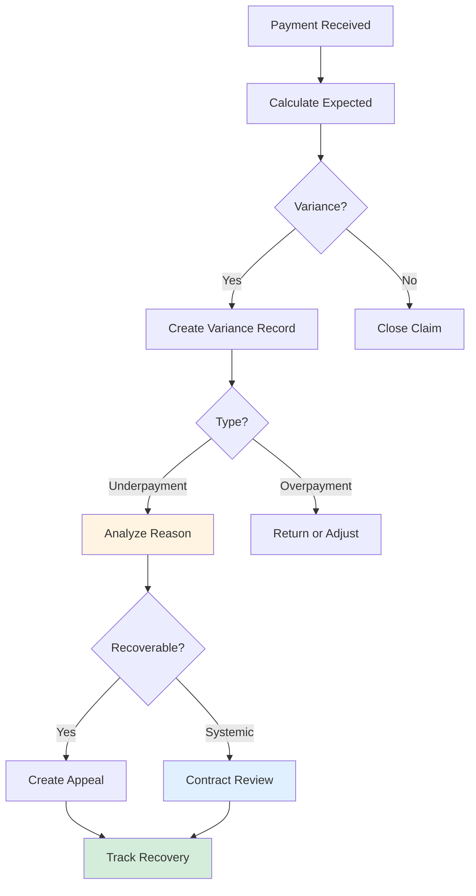

# Payment Variance Analysis

Detect and resolve discrepancies between expected and actual payments.

## Overview

Payment variances occur when payers pay different amounts than expected. AI helps identify underpayments, overpayments, and patterns indicating contract compliance issues.

## Tools Used

| Tool | Purpose |
|------|---------|
| `create_payment_variance` | Track underpayments/overpayments |
| `update_payment_variance` | Update resolution, link to appeals |
| `list_payment_variances` | Query variances with filters |
| `get_payment_variance_analytics` | Payer patterns and contract compliance |

## Example: Seeded Payment Variance

The database contains 1 seeded payment variance (Medicare underpayment):

| Variance | Claim | Payer | Expected | Actual | Variance | Type |
|----------|-------|-------|----------|--------|----------|------|
| b50e8400...001 | CLM-2024-001890 | Medicare | $500 | $425 | -$75 (-15%) | underpayment |

### Check Payment Variances

**User prompt:**

```
Do we have any underpayments we should look at?
```

**What happens:**

The `list_payment_variances` tool retrieves variances:

```json
{
  "variances": [
    {
      "id": "b50e8400-e29b-41d4-a716-446655440001",
      "claim_id": "650e8400-e29b-41d4-a716-446655440006",
      "payer_id": "550e8400-e29b-41d4-a716-446655440003",
      "expected_amount": 500.00,
      "actual_amount": 425.00,
      "variance_amount": -75.00,
      "variance_percentage": -15.00,
      "variance_type": "underpayment",
      "variance_reason": "contract_adjustment",
      "payment_date": "2024-02-25",
      "reason_notes": "Payer applied incorrect fee schedule. Expected payment based on 2024 Medicare rates, but 2023 rates were applied.",
      "requires_appeal": true,
      "resolved": false
    }
  ],
  "total": 1,
  "total_variance": -75.00
}
```

**Expected Response:**

> Found 1 underpayment requiring attention:
>
> - **CLM-2024-001890 (Medicare)**
>   - Expected: $500, Received: $425
>   - Variance: **-$75 (-15%)**
>   - Reason: Incorrect 2023 fee schedule applied instead of 2024 rates
>   - Status: Requires appeal
>
> **Recommendation:** Appeal this variance - it's a contract compliance issue with high success probability.

### Update Variance Resolution

**User prompt:**

```
We appealed the variance and got an additional $50. Mark it resolved.
```

**What happens:**

The `update_payment_variance` tool updates the record:

```json
{
  "variance_id": "b50e8400-e29b-41d4-a716-446655440001",
  "resolved": true,
  "resolution_date": "2024-03-15",
  "resolution_notes": "Appeal successful. Additional payment of $50 received. Remaining $25 variance accepted as contract adjustment."
}
```

### Variance Analytics

**User prompt:**

```
What are our payment variance patterns?
```

The `get_payment_variance_analytics` tool returns:

```json
{
  "total_variances": 1,
  "total_variance_amount": -75.00,
  "underpayment_total": 75.00,
  "overpayment_total": 0,
  "by_type": {
    "underpayment": { "count": 1, "amount": -75.00 }
  },
  "by_reason": {
    "contract_adjustment": { "count": 1, "amount": -75.00 }
  },
  "by_payer": {
    "Medicare": { "count": 1, "amount": -75.00, "avg_variance_pct": -15.0 }
  },
  "unresolved_count": 1,
  "insights": [
    "1 unresolved variance totaling $75",
    "Medicare shows -15% average variance - verify fee schedule",
    "100% of variances are contract_adjustment - review contract terms"
  ]
}
```

## Workflow Diagram



## Variance Types (Auto-Calculated)

| Type | Condition | Action |
|------|-----------|--------|
| `underpayment` | Actual less than Expected | Review for appeal |
| `overpayment` | Actual greater than Expected | Return or adjust |
| `expected` | Within 1 cent | No action needed |

## Variance Reasons

| Reason | Description | Typical Recovery |
|--------|-------------|-----------------|
| `contract_adjustment` | Rate differs from contract | High (95%) |
| `bundling` | Services bundled/downcoded | Medium (70%) |
| `non_covered_service` | Partial denial | Low (30%) |
| `incorrect_coding` | Downcoded by payer | High (85%) |
| `coordination_of_benefits` | COB adjustment | Varies |

## Key Analytics

- **Payer patterns** - Identify systematic underpayers
- **Variance percentages** - Track for contract negotiation
- **Appeal linkage** - Connect variances to appeals
- **Unresolved monitoring** - Prioritize open variances

## Next Steps

- **[Appeals Management](./appeals-management.md)** - Recover underpayments
- **[Cash Leakage](./cash-leakage.md)** - Identify variance patterns
- **[Denial Triage](./denial-triage.md)** - Handle related denials
