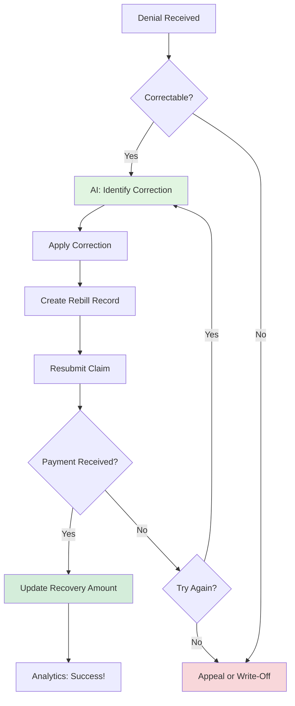

# Rebilling Workflow

Track claim corrections and resubmissions with AI-assisted correction guidance.

## Overview

Rebilling involves correcting and resubmitting claims that were denied due to fixable errors like coding mistakes, missing information, or incorrect modifiers.

## Why Use AI?

- **Error Identification** - AI identifies exactly what needs correction
- **Correction Guidance** - Provides specific fix instructions
- **Success Tracking** - Monitors which correction types succeed

## Workflow Diagram

## Example Correction

**User:**

> "Got CO-4 denial for missing modifier on claim CLM-2024-001567"

**AI Response:**

> **Denial Analysis: CO-4 (Modifier Error)**
>
> **Original Claim:**
>
> - CPT: 99213, 69210
> - Issue: Missing modifier 25 on E/M code
>
> **Correction Required:**
>
> - Add modifier 25 to 99213
> - New codes: 99213-25, 69210
>
> **Rebill Instructions:**
>
> 1. Void original claim (if required by payer)
> 2. Submit corrected claim with modifier
> 3. Include: "Corrected claim - modifier 25 added per payer request"
>
> **Expected Recovery:**
>
> - Original denial: $112 (E/M portion denied)
> - With correction: $112 recovered
> - Success probability: 95%
>
> Would you like me to create a rebill tracking record?

## Success Metrics

**Rebill Analytics:**

> **Q1 Rebill Performance**
>
> | Correction Type     | Count | Recovery Rate | Avg Days |
> | ------------------- | ----- | ------------- | -------- |
> | Modifier Correction | 78    | 94%           | 18 days  |
> | Diagnosis Code Fix  | 45    | 88%           | 22 days  |
> | Missing Info        | 34    | 76%           | 28 days  |
> | Authorization Added | 28    | 82%           | 32 days  |
>
> **Total Recovered:** $52,300
> **Average Success Rate:** 88%

## Next Steps

- **[Coding Validation](./coding-validation.md)** - Prevent rebills with pre-submission checks
- **[Denial Triage](./denial-triage.md)** - Identify rebill opportunities
