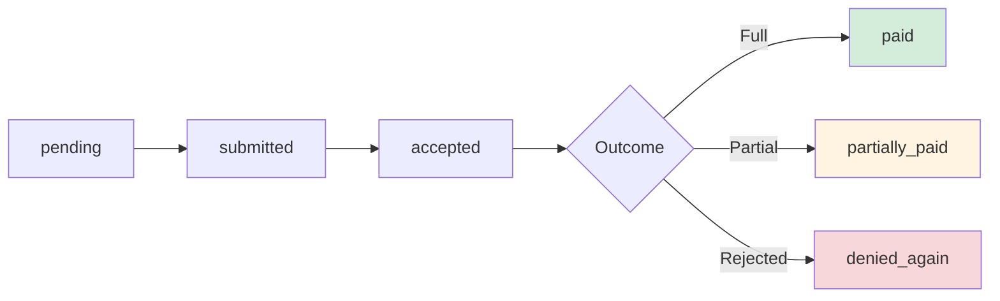

# Rebilling Workflow

Track claim corrections and resubmissions with success rate analytics.

## Overview

Rebilling involves correcting and resubmitting claims that were denied due to fixable errors like coding mistakes, missing information, or incorrect modifiers.

## Tools Used

| Tool                   | Purpose                                     |
| ---------------------- | ------------------------------------------- |
| `create_rebill`        | Create rebill after correcting denied claim |
| `update_rebill`        | Update rebill status and resolution         |
| `list_rebills`         | Query rebills with filters                  |
| `get_rebill_analytics` | Success rates by correction type            |

## Example: Seeded Rebill

The database contains 1 seeded rebill for the CO-4 modifier error:

| Rebill         | Original Claim  | New Claim       | Amount | Status | Recovered |
| -------------- | --------------- | --------------- | ------ | ------ | --------- |
| a50e8400...001 | CLM-2024-001237 | CLM-2024-001567 | $250   | paid   | $200      |

### Check Rebill Status

**User prompt:**

```
What's the status of our rebills?
```

**What happens:**

The `list_rebills` tool retrieves rebills:

```json
{
  "rebills": [
    {
      "id": "a50e8400-e29b-41d4-a716-446655440001",
      "original_claim_id": "650e8400-e29b-41d4-a716-446655440004",
      "new_claim_id": "650e8400-e29b-41d4-a716-446655440005",
      "denial_id": "750e8400-e29b-41d4-a716-446655440003",
      "rebill_reason": "added_modifier",
      "changes_made": {
        "original_codes": ["99213", "11102"],
        "corrected_codes": ["99213-25", "11102"],
        "change_description": "Added modifier 25 to E/M code 99213"
      },
      "reason_notes": "Modifier 25 required when billing E/M service on same day as procedure per payer guidelines",
      "rebill_amount": 250.0,
      "status": "paid",
      "submitted_date": "2024-02-10",
      "resolution_date": "2024-02-20",
      "recovered_amount": 200.0,
      "created_by": "Coding Specialist"
    }
  ],
  "total": 1
}
```

**Expected Response:**

> You have 1 rebill:
>
> - **CLM-2024-001237 → CLM-2024-001567**
>   - Correction: Added modifier 25 to 99213 (E/M with same-day procedure)
>   - Status: **Paid**
>   - Submitted: 2/10/2024, Resolved: 2/20/2024
>   - Recovered: **$200 of $250** (80%)
>
> This CO-4 denial was successfully corrected. Pre-submission validation would have prevented it.

### Rebill Analytics

**User prompt:**

```
Show me our rebill success rate.
```

The `get_rebill_analytics` tool returns:

```json
{
  "total_rebills": 1,
  "total_amount": 250.0,
  "total_recovered": 200.0,
  "success_rate": 100,
  "recovery_rate": 80,
  "by_reason": {
    "added_modifier": {
      "count": 1,
      "amount": 250.0,
      "recovered": 200.0,
      "success_rate": 100
    }
  },
  "by_status": {
    "paid": 1
  },
  "insights": [
    "100% rebill success rate (1 of 1)",
    "80% recovery rate ($200 of $250)",
    "Top correction type: added_modifier (100% success)"
  ]
}
```

## Rebill Lifecycle



## Rebill Reasons

| Reason              | Description                        | Typical Success Rate |
| ------------------- | ---------------------------------- | -------------------- |
| `corrected_coding`  | Fixed CPT/diagnosis codes          | 85%                  |
| `added_modifier`    | Added required modifier            | 90%                  |
| `updated_diagnosis` | Changed/added diagnosis codes      | 80%                  |
| `corrected_info`    | Fixed patient/provider info        | 75%                  |
| `resubmit_timely`   | Resubmitting within timely filing  | 70%                  |
| `provider_change`   | Changed rendering/billing provider | 65%                  |

## Correction Tracking

The `changes_made` field tracks exactly what was corrected:

```json
{
  "original_codes": ["99213", "11102"],
  "corrected_codes": ["99213-25", "11102"],
  "change_description": "Added modifier 25 to E/M code 99213"
}
```

This enables:

- Root cause analysis
- Training identification
- Prevention rule creation

## Next Steps

- **[Coding Validation](./coding-validation.md)** - Prevent rebills with pre-submission checks
- **[Denial Triage](./denial-triage.md)** - Identify rebill opportunities
- **[Cash Leakage](./cash-leakage.md)** - Analyze rebill patterns
