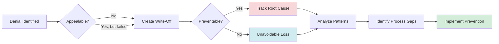

# Write-Off Analysis

Track uncollectible denials with preventability analysis to reduce future losses.

## Overview

Write-offs represent accepted financial losses where denials cannot be recovered. Tracking with preventability analysis helps identify root causes and prevent similar losses.

## Why Track with AI?

- **Root Cause Analysis** - Categorizes by reason and identifies process gaps
- **Financial Accountability** - Separates unavoidable vs. preventable losses
- **Continuous Improvement** - Trends show if prevention efforts work

## Workflow Diagram

## Example Analysis

**AI Analytics Response:**

> **Q1 Write-Off Analysis**
>
> Total: 342 write-offs, $87,450
> **Preventable: 156 write-offs, $52,300 (60%)**
>
> **By Reason:**
>
> | Reason             | Count | Amount  | Preventable | Root Cause             |
> | ------------------ | ----- | ------- | ----------- | ---------------------- |
> | Timely Filing      | 89    | $37,650 | 95%         | Claim tracking gaps    |
> | Patient Liability  | 124   | $18,200 | 10%         | Expected               |
> | Contract Exclusion | 78    | $21,100 | 43%         | Contract not in system |
> | Small Balance      | 51    | $10,500 | 0%          | Per policy under $25   |
>
> **Recommendations:**
>
> 1. **Timely Filing** ($35,700 preventable/quarter)
>    - Solution: Automated claim tracking with 30-day alerts
>    - Cost: $15K setup + $500/month
>    - ROI: Pays for itself in less than 1 quarter
> 2. **Contract Exclusions** ($9,000 preventable/quarter)
>    - Solution: Add payer contract rules to system
>    - Prevents pre-authorization on excluded services

## Real-World Impact

**Example Organization:**

- Q1 preventable write-offs: $52,300
- Implemented claim tracking + contract rules
- Q2 preventable write-offs: $22,100
- **Quarterly savings: $30,200**
- **Annual impact: $120,800**

## Next Steps

- **[Appeals Workflow](./appeals-management.md)** - Exhaust appeal options first
- **[Cash Leakage](./cash-leakage.md)** - Identify write-off trends
