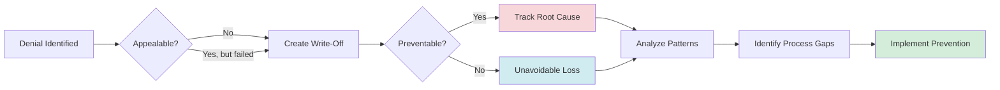

# Write-Off Analysis

Track uncollectible denials with preventability analysis to reduce future losses.

## Overview

Write-offs represent accepted financial losses where denials cannot be recovered. Tracking with preventability analysis helps identify root causes and prevent similar losses.

## Tools Used

| Tool | Purpose |
|------|---------|
| `create_write_off` | Write off uncollectible amount with preventability tracking |
| `list_write_offs` | Query write-offs with filters |
| `get_write_off_analytics` | Preventable write-off analysis |

## Example: Seeded Write-Off

The database contains 1 seeded write-off:

| Write-Off | Denial | Claim | Amount | Reason | Preventable |
|-----------|--------|-------|--------|--------|-------------|
| 950e8400...001 | PR-1 | CLM-2024-001236 | $15 | below_threshold | Yes |

### Review Write-Offs

**User prompt:**

```
Show me our write-offs and whether they were preventable.
```

**What happens:**

The `list_write_offs` tool retrieves write-offs:

```json
{
  "write_offs": [
    {
      "id": "950e8400-e29b-41d4-a716-446655440001",
      "denial_id": "750e8400-e29b-41d4-a716-446655440002",
      "claim_id": "650e8400-e29b-41d4-a716-446655440003",
      "write_off_amount": 15.00,
      "write_off_reason": "below_threshold",
      "reason_notes": "Amount below $25 small-balance threshold per organization policy. Cost to pursue exceeds potential recovery.",
      "approved_by": "Billing Manager",
      "approval_date": "2024-01-30",
      "category": "PATIENT_RESPONSIBILITY",
      "is_preventable": true
    }
  ],
  "total": 1,
  "total_amount": 15.00
}
```

**Expected Response:**

> You have 1 write-off totaling $15:
>
> - **CLM-2024-001236**: $15 written off (below $25 threshold)
> - Reason: PR-1 patient responsibility, cost to pursue exceeds recovery
> - Approved by: Billing Manager on 1/30/2024
> - **Preventable: Yes** - eligibility could have been verified at registration

### Write-Off Analytics

**User prompt:**

```
What's our write-off analysis?
```

The `get_write_off_analytics` tool returns:

```json
{
  "total_write_offs": 1,
  "total_amount": 15.00,
  "preventable_count": 1,
  "preventable_amount": 15.00,
  "preventable_percentage": 100,
  "by_reason": {
    "below_threshold": { "count": 1, "amount": 15.00 }
  },
  "by_category": {
    "PATIENT_RESPONSIBILITY": { "count": 1, "amount": 15.00 }
  },
  "insights": [
    "100% of write-offs ($15) are preventable",
    "Top reason: below_threshold (100%)",
    "Consider eligibility verification at registration"
  ]
}
```

## Workflow Diagram



## Write-Off Reasons

| Reason | Description | Typically Preventable |
|--------|-------------|----------------------|
| `below_threshold` | Amount too small to pursue | Sometimes |
| `timely_filing_expired` | Past appeal deadline | Yes |
| `non_covered_service` | Service not covered by plan | Sometimes |
| `patient_responsibility` | Transferred to patient balance | Sometimes |
| `contract_adjustment` | Contractual write-off | No |
| `uncollectible` | Unable to collect | Varies |

## Categories

- **ADMINISTRATIVE** - Process failures (timely filing, missing info)
- **CLINICAL** - Documentation issues (medical necessity)
- **FINANCIAL** - Contract/coverage issues (exclusions, limits)
- **PATIENT_RESPONSIBILITY** - Patient owes (deductible, copay)

## Next Steps

- **[Appeals Management](./appeals-management.md)** - Exhaust appeal options first
- **[Cash Leakage](./cash-leakage.md)** - Identify write-off trends
- **[Denial Triage](./denial-triage.md)** - Route denials appropriately
