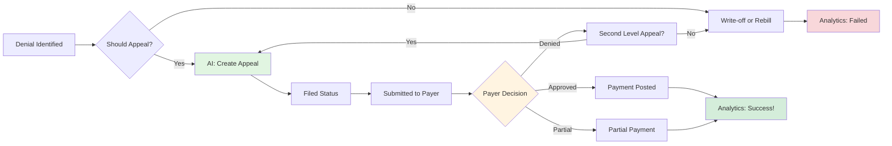

# Appeals Management

Track appeal lifecycle from filing through resolution with AI-powered status monitoring and analytics.

## Overview

The appeals workflow helps manage the complete lifecycle of denial appeals, from initial filing through payer decision and payment posting. AI assists with creating appeals, monitoring deadlines, and analyzing success patterns.

## Why Use AI for Appeals?

### Automated Tracking

- AI creates appeal records from conversational requests
- Automatically links appeals to denials and claims
- Monitors due dates and identifies overdue items

### Intelligent Analytics

- Analyzes success rates by appeal type, payer, and category
- Identifies which appeals are worth pursuing
- Learns from outcomes to improve future recommendations

### Efficiency

- No manual data entry forms
- Natural language creates structured records
- Instant status queries across all appeals

## Workflow



## Example Interaction

### Creating an Appeal

**User:**

> "Create an appeal for that $450 authorization denial (claim CLM-2024-001234). We found the auth number - it's AUTH-987654."

**AI Assistant:**

> ✅ Appeal created successfully!
>
> **Appeal Details:**
>
> - Appeal ID: APL-2024-000156
> - Type: First Level Appeal
> - Amount: $450.00
> - Priority: High (exceeds $250 threshold)
> - Filing Date: Today (01/20/2024)
> - Due Date: 02/20/2024 (30 days)
> - Status: Pending submission
>
> **Supporting Documentation:**
>
> - Authorization number: AUTH-987654
>
> **Next Steps:**
>
> 1. Attach clinical documentation to appeal record
> 2. Submit appeal package to payer by 01/27/2024
> 3. Update status to "submitted" when filed
> 4. I'll remind you on 02/15/2024 to check status (5 days before deadline)
>
> Would you like me to generate the appeal letter text?

### Monitoring Appeals

**User:**

> "What appeals are overdue?"

**AI Assistant:**

> **⚠️ 3 Overdue Appeals Found**
>
> | Appeal ID       | Amount | Days Overdue | Claim           | Next Action            |
> | --------------- | ------ | ------------ | --------------- | ---------------------- |
> | APL-2024-000142 | $680   | 5 days       | CLM-2024-001187 | Follow up with payer   |
> | APL-2024-000139 | $520   | 12 days      | CLM-2024-001165 | Escalate to supervisor |
> | APL-2024-000131 | $1,240 | 18 days      | CLM-2024-001098 | Consider second level  |
>
> **Total at Risk:** $2,440
>
> **Recommended Actions:**
>
> - APL-2024-000131: This is significantly overdue. Call payer appeals department today.
> - APL-2024-000139: Send status inquiry letter with tracking
> - APL-2024-000142: Email payer appeals contact for update
>
> Should I draft status inquiry letters for these?

### Analytics

**User:**

> "What's our appeal success rate?"

**AI Assistant:**

> **Appeal Performance Dashboard**
>
> **Overall Success Rate: 62%** (Last 90 days)
>
> - Approved: 156 appeals ($68,400)
> - Denied: 78 appeals ($29,200)
> - Partially Approved: 18 appeals ($12,100 of $18,600 requested)
>
> **By Appeal Type:**
> | Type | Success Rate | Avg Days to Decision |
> |------|--------------|---------------------|
> | First Level | 67% | 28 days |
> | Second Level | 48% | 42 days |
> | Third Level | 31% | 58 days |
> | External Review | 71% | 67 days |
>
> **By Denial Category:**
> | Category | Success Rate | Recommendation |
> |----------|--------------|----------------|
> | Coding Error | 89% | ✅ Always appeal >$100 |
> | Authorization | 71% | ✅ Always appeal >$250 |
> | Medical Necessity | 52% | ⚠️ Selective - need strong clinical support |
> | Timely Filing | 8% | ❌ Only with extraordinary circumstances |
>
> **By Payer:**
> | Payer | Success Rate | Notes |
> |-------|--------------|-------|
> | United Healthcare | 73% | Strong appeals program |
> | Blue Cross | 64% | Standard |
> | Aetna | 58% | Requires detailed clinical |
> | Medicare | 51% | High burden of proof |
>
> **💡 Insights:**
>
> - Your first-level appeals are performing well (67% vs. industry 55%)
> - Consider skipping appeals for timely filing unless exceptional circumstances
> - United Healthcare has best success rate - appeal aggressively with them
> - Medical necessity appeals need stronger clinical documentation

## Tool Usage

### Create Appeal

```typescript
create_appeal({
  denial_id: 'uuid-of-denial',
  claim_id: 'uuid-of-claim',
  appeal_type: 'first_level',
  appeal_amount: 450.0,
  appeal_reason: 'Authorization was obtained prior to service',
  supporting_documents: {
    items: [
      {
        type: 'authorization',
        number: 'AUTH-987654',
        date: '2024-01-10',
      },
    ],
  },
  priority: 'high',
})
```

### Update Appeal

```typescript
update_appeal({
  appeal_id: 'uuid-of-appeal',
  status: 'submitted',
  filed_date: '2024-01-20',
  notes: 'Submitted via payer portal with tracking #12345',
})

// Later, after payer decision
update_appeal({
  appeal_id: 'uuid-of-appeal',
  status: 'approved',
  decision_date: '2024-02-15',
  approved_amount: 450.0,
  payer_response: 'Appeal approved. Authorization verified in system.',
})
```

### List Appeals

```typescript
// Find overdue appeals
list_appeals({
  status: ['submitted', 'under_review'],
  overdue: true,
})

// Find high-priority appeals
list_appeals({
  priority: 'high',
  status: ['pending', 'in_progress'],
})
```

### Get Analytics

```typescript
get_appeal_analytics({
  start_date: '2024-01-01',
  end_date: '2024-03-31',
})
```

## Best Practices

### Filing Best Practices

1. **File quickly** - Most payers have 30-60 day windows
2. **Include all documentation** - Authorization numbers, clinical notes, policies
3. **Reference payer policy** - Show why they should pay per their own rules
4. **Be specific** - Cite exact policy sections and contract language

### Tracking Best Practices

1. **Update immediately** - Change status when actions occur
2. **Set reminders** - Check status 5 days before deadline
3. **Document everything** - Notes on all payer communications
4. **Track fax/mail confirmations** - Proof of timely filing

### Success Optimization

1. **Learn from outcomes** - Review denied appeals to improve
2. **Payer-specific strategies** - Track what works with each payer
3. **Clinical collaboration** - Involve physicians for medical necessity appeals
4. **Escalate appropriately** - Know when to pursue higher appeal levels

## Real-World Impact

### Time Savings

- **Creating appeal record**: 5 minutes → 10 seconds
- **Checking overdue appeals**: 15 minutes → 10 seconds
- **Generating success rate report**: 30 minutes → 10 seconds
- **Monthly time saved per appeal specialist**: ~20 hours

### Financial Impact

- **Typical organization**: 500 appeals/month
- **Success rate improvement**: 55% → 62% (with better tracking)
- **Average appeal amount**: $425
- **Additional monthly recovery**: 35 appeals × $425 = **$14,875**
- **Annual impact**: **$178,500**

### Quality Improvements

- **Reduced overdue appeals**: 12% → 2%
- **Improved documentation**: 78% → 94% complete
- **Better payer relationships**: Fewer escalations needed
- **Staff satisfaction**: Less administrative burden

## Next Steps

- **[Set up first appeal](/docs/mcp-server/workflows/denial-triage)** - Start with denial triage
- **[Analyze cash leakage](/docs/mcp-server/workflows/cash-leakage)** - Find appealable denials
- **[Track write-offs](/docs/mcp-server/workflows/write-offs)** - Monitor unsuccessful appeals
