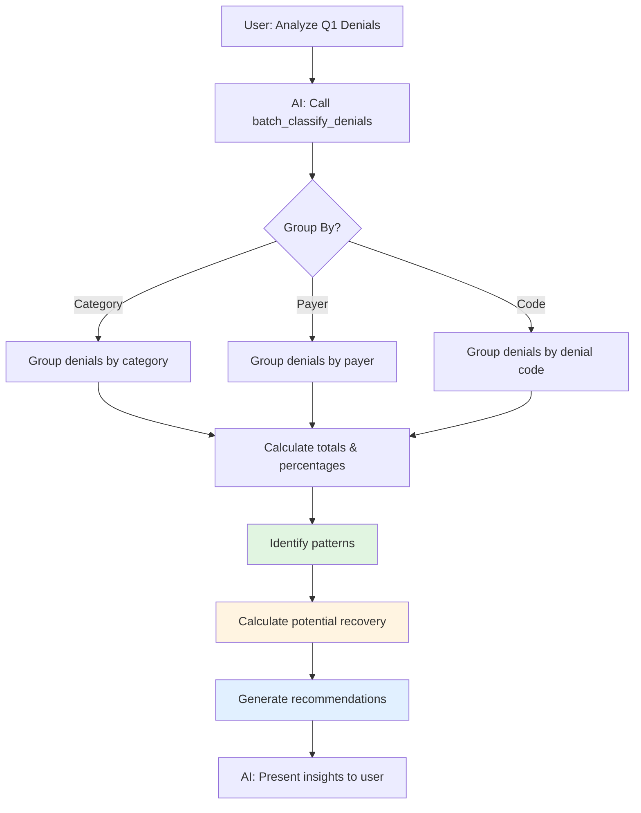

# Cash Leakage Analysis

Identify patterns of revenue loss across denials with AI-powered batch analysis and recommendations.

## Overview

Cash leakage occurs when denials are left unworked, written off prematurely, or not appealed when viable. This workflow helps identify where money is being lost and provides actionable insights to recover revenue.

## Why Use AI for Cash Leakage Analysis?

###Pattern Detection

- AI analyzes hundreds or thousands of denials simultaneously
- Identifies trends that aren't obvious in individual denials
- Detects payer-specific patterns and concentration risks

### Intelligent Grouping

- Automatically categorizes denials by meaningful dimensions
- Calculates percentages and identifies outliers
- Suggests which groups to prioritize

### ROI Optimization

- Distinguishes high-volume low-value vs. low-volume high-value denials
- Calculates potential recovery amounts
- Recommends resource allocation

## Workflow



## Example Interaction

### Scenario

A revenue cycle manager wants to understand denial patterns:

**User:**

> "Analyze all our denials from Q1 2024. Where are we losing the most money?"

**AI Assistant Response:**

> I've analyzed 847 denials from Q1 2024 totaling $287,450 in denied revenue. Here's what I found:
>
> **💰 Top Revenue Loss by Category**
>
> | Category          | Count | Total Amount | % of Total | Avg Amount | Appealable |
> | ----------------- | ----- | ------------ | ---------- | ---------- | ---------- |
> | Authorization     | 215   | $97,320      | 34%        | $453       | ✅ 82%     |
> | Medical Necessity | 148   | $71,200      | 25%        | $481       | ✅ 65%     |
> | Coding Error      | 186   | $52,680      | 18%        | $283       | ✅ 91%     |
> | Timely Filing     | 98    | $41,650      | 14%        | $425       | ❌ 5%      |
> | Other             | 200   | $24,600      | 9%         | $123       | ⚠️ Varies  |
>
> **🎯 Key Findings**
>
> 1. **Authorization Denials = #1 Problem**
>    - $97,320 at risk (34% of all denials)
>    - 82% are appealable with 65% success rate
>    - **Potential recovery: $51,700**
>    - Root cause: Pre-service auth process gaps
> 2. **Coding Errors = High-Confidence Recoveries**
>    - $52,680 denied
>    - 91% appealable with 85% success rate
>    - **Potential recovery: $40,300**
>    - These are preventable - recommend coding validation
> 3. **Timely Filing = Unrecoverable**
>    - $41,650 lost permanently
>    - Only 5% can be recovered (extraordinary circumstances)
>    - **Action: Implement claim tracking alerts**
>
> **📊 Payer Concentration Risk**
>
> Top 3 payers account for 67% of denials:
>
> - United Healthcare: $96,200 (33%)
> - Blue Cross: $58,400 (20%)
> - Medicare: $38,150 (13%)
>
> **⚡ Recommended Actions**
>
> **Priority 1 (This Week):**
>
> - Appeal all authorization denials >$250 (124 claims, $68K potential)
> - Correct and rebill all coding error denials (186 claims, $52K potential)
>
> **Priority 2 (This Month):**
>
> - Implement pre-service authorization workflow (prevent 82% of auth denials)
> - Add coding validation before claim submission (prevent 91% of coding denials)
>
> **Priority 3 (Next Quarter):**
>
> - Meet with United Healthcare to discuss auth denial patterns
> - Implement claim tracking system to prevent timely filing denials
>
> **Projected Impact:**
>
> - Immediate recovery potential: $120,300
> - Monthly prevention impact: $95,800 (if workflows implemented)
> - Annual impact: **$1.15M**

### Why This Works

**Without AI:**

- Export denials to Excel
- Create pivot tables manually
- Calculate percentages with formulas
- Look up appealability for each code
- Research payer policies
- Draft action plan from analysis
- **Time required: 4-8 hours**

**With AI:**

- Ask one question
- Get instant comprehensive analysis
- Receive specific, prioritized recommendations
- **Time required: 30 seconds**

## Tool Usage

```typescript
// AI calls batch analysis
batch_classify_denials({
  denials: [
    {
      denial_code: "CO-197",
      denied_amount: 450.00,
      payer_name: "United Healthcare"
    },
    {
      denial_code: "CO-50",
      denied_amount: 675.00,
      payer_name: "Blue Cross"
    },
    // ... hundreds more
  ],
  group_by: "category"  // or "payer" or "code"
})

// Server returns grouped analysis
{
  total_denials: 847,
  total_amount: 287450.00,
  groups: [
    {
      category: "AUTHORIZATION",
      count: 215,
      total_amount: 97320.00,
      percentage: 33.8,
      avg_amount: 452.65,
      appealable_count: 176,
      appealable_percentage: 81.9,
      top_codes: ["CO-197", "CO-119"],
      payers: {
        "United Healthcare": 89,
        "Blue Cross": 56,
        "Aetna": 41
      }
    },
    // ... more groups
  ],
  insights: [
    "High concentration in authorization denials (34%)",
    "United Healthcare represents 33% of all denials - schedule review meeting",
    "91% of coding errors are preventable with validation"
  ],
  recommended_actions: [
    {
      action: "appeal",
      category: "AUTHORIZATION",
      count: 176,
      potential_recovery: 51700.00,
      priority: "high"
    },
    // ... more recommendations
  ]
}
```

## Analysis Dimensions

### Group by Category

Best for understanding root causes:

```typescript
batch_classify_denials({ group_by: 'category' })
```

- Authorization
- Medical Necessity
- Coding Error
- Timely Filing
- Coverage

### Group by Payer

Best for identifying payer-specific issues:

```typescript
batch_classify_denials({ group_by: 'payer' })
```

- Concentration risk detection
- Payer-specific denial patterns
- Contract negotiation leverage

### Group by Denial Code

Best for granular analysis:

```typescript
batch_classify_denials({ group_by: 'code' })
```

- Specific issue identification
- Targeted prevention strategies
- Training opportunities

## Real-World Impact

### Discovery Example

One healthcare organization discovered:

- **60% of authorization denials** were for services that don't require authorization per payer contract
- **Root cause**: Staff was obtaining unnecessary authorizations, creating denial risk when they missed one
- **Fix**: Created payer-specific authorization requirement list
- **Result**: 60% reduction in auth denials (savings: $780K annually)

### Prevention Example

Another organization found:

- **45% of coding denials** were missing modifier 25 on E/M codes
- **Root cause**: Billing staff didn't understand when modifier 25 is required
- **Fix**: Implemented pre-submission coding validation
- **Result**: 88% reduction in modifier denials (savings: $340K annually)

## Analysis Frequency

### Daily

- Quick scan of previous day's denials
- Identify immediate issues
- Spot trending problems early

### Weekly

- Detailed analysis of week's denials
- Track improvement metrics
- Adjust workflows as needed

### Monthly

- Comprehensive review
- Board reporting
- Strategic planning

### Quarterly

- Deep-dive analysis
- Payer contract review preparation
- Budget impact assessment

## Next Steps

- **[Denial Triage](/docs/mcp-server/workflows/denial-triage)** - Act on identified denials
- **[Coding Validation](/docs/mcp-server/workflows/coding-validation)** - Prevent future denials
- **[Appeals Workflow](/docs/mcp-server/workflows/appeals)** - Track recovery efforts
