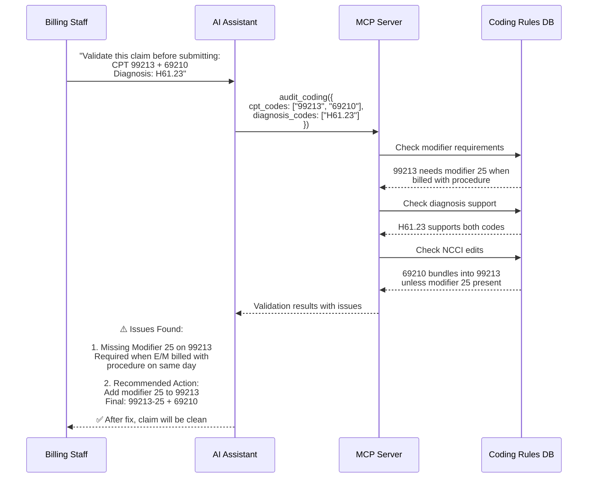

# Pre-Submission Coding Validation

Prevent denials before claim submission with AI-powered coding rule validation.

## Overview

Pre-submission coding validation catches errors before claims are sent to payers. This prevents denials, reduces rework, and improves first-pass payment rates. AI applies complex coding rules instantly, checking modifiers, diagnosis support, and payer-specific requirements.

## Why Use AI for Coding Validation?

### Complexity Management

- NCCI edits contain thousands of bundling rules
- Modifier requirements vary by CPT code and payer
- Diagnosis support rules are constantly updated
- AI knows all rules and applies them consistently

### Speed

- Manual validation: 3-5 minutes per claim (review coding books, check NCCI, verify modifiers)
- AI validation: < 1 second with detailed explanation

### Prevention is Cheaper Than Appeal

- **Cost to fix before submission**: $0 (just correct the claim)
- **Cost to fix after denial**: Staff time ($25) + delay (30-60 days) + appeal cost ($15)
- **ROI**: Prevent 100 denials/month = **$4,000 monthly savings**

## Workflow



## Example Interaction

### Scenario: Missing Modifier

**User:**

> "Check this claim before I submit: Patient visit for ear pain, doctor did exam (99213) and removed earwax (69210). Diagnosis H61.23 (impacted cerumen)."

**AI Assistant:**

> I've validated your claim. Here's what I found:
>
> **⚠️ 1 Issue Found - Will Cause Denial**
>
> **Issue:** Missing Modifier 25 on E/M Code
>
> - You're billing CPT 99213 (E/M visit) with 69210 (cerumen removal) on the same day
> - Per NCCI edits, 69210 includes an E/M service
> - Payer will bundle 69210 into 99213 and deny the visit code
>
> **Why This Happens:**
> Payers assume the E/M visit was only to perform the procedure. Modifier 25 tells them the E/M was a significant, separately identifiable service beyond the procedure.
>
> **Fix:**
> Add modifier 25 to the E/M code:
>
> - **Before:** 99213, 69210
> - **After:** 99213-25, 69210
>
> **Documentation Requirement:**
> Make sure the visit note shows:
>
> - Chief complaint (ear pain)
> - History and exam performed
> - Medical decision making for the ear condition
> - Separate documentation that procedure (wax removal) was performed
>
> **Expected Payment:**
>
> - 99213-25: ~$112
> - 69210: ~$47
> - Total: ~$159 ✅
>
> Without modifier 25, you'd only get paid ~$112 (loss of $47 per claim).
>
> ✅ Claim is now ready to submit!

### Scenario: Diagnosis Support

**User:**

> "Validate screening colonoscopy: CPT 45378, diagnosis Z12.11"

**AI Assistant:**

> ✅ Claim validation passed!
>
> **Validated Elements:**
>
> - CPT 45378 (Colonoscopy, diagnostic)
> - Diagnosis Z12.11 (Encounter for screening for malignant neoplasm of colon)
>
> **Checks Performed:**
> ✅ Diagnosis supports CPT code
> ✅ Screening diagnosis is appropriate for screening procedure
> ✅ No modifiers required for standard screening
> ✅ No NCCI bundling issues
>
> **Payer-Specific Note:**
> Medicare covers screening colonoscopy every 10 years for average-risk patients, every 2 years for high-risk. Make sure patient meets frequency requirements.
>
> **Coding Best Practice:**
> If polyps were found and removed during screening:
>
> - Primary diagnosis stays Z12.11 (keeps it as screening)
> - Add secondary diagnosis for polyps (D12.x)
> - May need to add polyp removal code (45385, 45380, etc.)
>
> ✅ Claim is ready to submit as-is for standard screening.

## Validation Rules

### Modifier Requirements

| Situation                  | Required Modifier | Example          |
| -------------------------- | ----------------- | ---------------- |
| E/M + Procedure (same day) | 25                | 99213-25 + 69210 |
| Bilateral procedure        | 50                | 69210-50         |
| Multiple procedures        | 59 or XU/XS/XP/XE | 69210 + 69220-59 |
| Reduced service            | 52                | 43235-52         |
| Discontinued procedure     | 53                | 45378-53         |
| Assistant surgeon          | 80                | 47562-80         |
| RT/LT (laterality)         | RT or LT          | 69210-RT         |

### Common Validation Checks

```typescript
audit_coding({
  cpt_codes: ["99213", "99214"], // Multiple E/Ms - likely error
  diagnosis_codes: ["Z00.00"],    // General exam - may not support E/M level
  payer_type: "medicare"
})

// Returns
{
  errors: [
    {
      severity: "error",
      code: "multiple_em_codes",
      message: "Cannot bill multiple E/M codes on same day for same patient",
      suggestion: "Bill only one E/M code (usually the higher level)"
    }
  ],
  warnings: [
    {
      severity: "warning",
      code: "diagnosis_level_support",
      message: "Z00.00 (general health exam) may not support level 4 E/M (99214)",
      suggestion: "Verify documentation supports level 4 complexity"
    }
  ]
}
```

## Real-World Impact

### Denial Prevention

**Before AI Validation:**

- Denials due to coding errors: 15% of all claims
- Average coding error denial: $285
- Monthly coding denials: 450 claims
- Monthly loss (appeals + delays): $128,250

**After AI Validation:**

- Coding denials reduced by 88%
- Monthly coding denials: 54 claims
- Monthly loss: $15,390
- **Monthly savings: $112,860**
- **Annual savings: $1.35M**

### Time Savings

**Per Claim:**

- Manual validation: 3-5 minutes
- AI validation: < 1 second
- **Time saved per claim: 3-5 minutes**

**Per Month (10,000 claims):**

- Manual: 500-833 hours
- AI: < 3 hours
- **Time saved: 497-830 hours**
- **FTE reduction: 12-20 staff**

### Quality Improvements

| Metric                | Before AI | After AI | Improvement |
| --------------------- | --------- | -------- | ----------- |
| First-pass acceptance | 82%       | 95%      | +13%        |
| Coding accuracy       | 79%       | 96%      | +17%        |
| Days in AR            | 38 days   | 29 days  | -24%        |
| Clean claim rate      | 78%       | 93%      | +15%        |

## Common Coding Errors Caught

### Missing Modifier 25

**Impact:** ~40% of coding denials  
**AI Detection:** 100%  
**Example:** "CPT 99213 billed with 69210 requires modifier 25"

### Invalid Diagnosis Support

**Impact:** ~25% of coding denials  
**AI Detection:** 98%  
**Example:** "Z00.00 (routine exam) doesn't support 99213 (problem visit)"

### NCCI Bundling Violations

**Impact:** ~20% of coding denials  
**AI Detection:** 99%  
**Example:** "CPT 43239 bundles into 43235, cannot bill separately"

### Incorrect Modifier Usage

**Impact:** ~10% of coding denials  
**AI Detection:** 95%  
**Example:** "Modifier 59 not appropriate - use XU instead for distinct procedural service"

### Missing Bilateral Modifier

**Impact:** ~5% of coding denials  
**AI Detection:** 100%  
**Example:** "Bilateral knee injection requires modifier 50 or RT/LT"

## Integration Points

### Before Claim Submission

```typescript
// Validate every claim before sending
const result = await audit_coding(claimData)
if (result.errors.length > 0) {
  // Hold claim, display errors
  // Staff fixes issues
  // Revalidate before submission
}
```

### Real-Time Validation (User Entry)

```typescript
// Check as user enters codes
onCptCodeChange(async (codes) => {
  const validation = await audit_coding({ cpt_codes: codes })
  displayInlineWarnings(validation.warnings)
})
```

### Batch Validation

```typescript
// Validate all claims in queue
const claims = await getUnsubmittedClaims()
for (const claim of claims) {
  const result = await audit_coding(claim)
  if (result.errors.length === 0) {
    await submitClaim(claim)
  } else {
    await holdClaim(claim, result.errors)
  }
}
```

## Next Steps

- **[Denial Triage](/docs/mcp-server/workflows/denial-triage)** - Handle denials that slip through
- **[Cash Leakage](/docs/mcp-server/workflows/cash-leakage)** - Analyze coding error patterns
- **[Database Setup](/docs/migrations/setup)** - Configure coding rules
