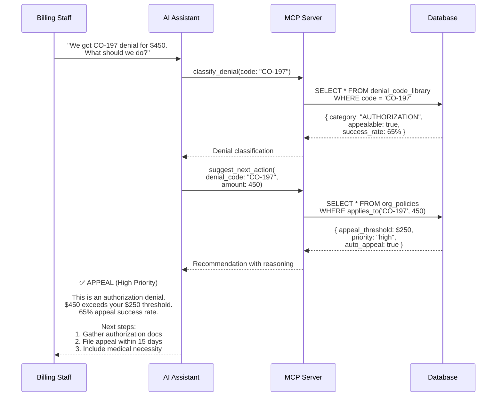

# Denial Triage Workflow

Intelligent classification of denial codes with AI-powered action recommendations based on organization policies.

## Overview

The denial triage workflow helps billing staff quickly understand why claims were denied and what action to take. Instead of manually researching denial codes and checking policy documents, staff can ask an AI assistant for instant recommendations.

## Why Use AI for Denial Triage?

### Speed

- **Manual process**: Look up denial code → Read policy documents → Calculate thresholds → Decide action (5-10 minutes)
- **AI process**: Ask question → Get instant recommendation with reasoning (10 seconds)

### Consistency

- AI applies policies uniformly across all denials
- Eliminates human error in threshold calculations
- Ensures compliance with organizational rules

### Intelligence

- Considers multiple factors simultaneously (amount, appealability, payer history, deadlines)
- Learns from denial code library with success rates
- Provides context-aware recommendations

## Workflow



## Example Interaction

### Scenario

A billing specialist receives a denial and asks for guidance:

**User:**

> "We're getting CO-197 denials on outpatient imaging claims. One claim is for $450 (CPT 70553 - MRI brain). What should we do?"

**AI Assistant Response:**

> I've analyzed this denial for you:
>
> **Denial Type:** CO-197 (Authorization Missing)  
> **Category:** AUTHORIZATION  
> **Appealable:** Yes (65% historical success rate)
>
> **Recommendation: APPEAL (High Priority)**
>
> **Why Appeal?**
>
> - Amount ($450) exceeds your organization's appeal threshold of $250 for authorization denials
> - This denial category has a 65% success rate on appeal
> - Authorization issues are often reversible with proper documentation
>
> **Action Plan:**
>
> 1. **Gather Documentation** (Today)
>    - Check if authorization was actually obtained (may be in different system)
>    - Collect referring physician order
>    - Pull medical necessity documentation (patient symptoms, prior treatments)
> 2. **File Appeal** (Within 15 days)
>    - Submit to payer's appeal address
>    - Include: Authorization number (if obtained), clinical notes, physician order
>    - Reference payer policy showing authorization not required OR was obtained
> 3. **Track Progress**
>    - Expected resolution: 30 days
>    - Set follow-up reminder for day 20
>
> **Prevention:**
> For future claims, implement pre-service authorization checks for imaging procedures (CPT 70000-79999).
>
> Would you like me to create an appeal record to track this?

### Why This Works

**Without AI:**

- Staff must remember or look up what CO-197 means
- Must check appeal threshold policy document
- Must calculate if $450 meets threshold
- Must check success rate data (if available)
- Must recall standard procedures for authorization denials

**With AI:**

- Single question gets complete answer
- AI retrieves all relevant information
- AI applies policies automatically
- AI provides specific, actionable steps
- AI offers to create tracking record

## Tool Sequence

### 1. Classify Denial

```typescript
// AI calls MCP server
classify_denial({
  denial_code: "CO-197"
})

// Server returns
{
  code: "CO-197",
  category: "AUTHORIZATION",
  description: "Precertification/authorization/notification absent",
  is_appealable: true,
  appeal_success_rate: 65,
  avg_recovery_days: 30,
  common_resolution: "Obtain retroactive authorization or appeal with medical necessity",
  prevention_tips: "Implement pre-service authorization checks"
}
```

### 2. Get Recommendation

```typescript
// AI calls MCP server
suggest_next_action({
  denial_code: "CO-197",
  denial_amount: 450.00,
  payer_id: "uuid-of-payer", // optional
  claim_data: {
    cpt_code: "70553",
    service_date: "2024-01-15"
  }
})

// Server returns
{
  recommended_action: "appeal",
  reason: "Amount $450 exceeds appeal threshold of $250 for authorization denials",
  priority: "high",
  days_to_action: 15,
  auto_process: true,
  policy_applied: "Authorization Denials - Auto Appeal",
  estimated_recovery_chance: 65,
  estimated_recovery_days: 30,
  next_steps: [
    "Check if authorization was obtained (may be in different system)",
    "Gather clinical documentation supporting medical necessity",
    "File appeal within timely filing limits (typically 30-60 days)",
    "Include: authorization number OR proof of emergency OR medical necessity"
  ]
}
```

## Customization

### Adjust Appeal Thresholds

```sql
-- Increase threshold for authorization denials to $500
UPDATE org_policies
SET rules = jsonb_set(
  rules,
  '{min_amount}',
  '500.00'
)
WHERE policy_type = 'appeal_threshold'
AND policy_name LIKE '%Authorization%';
```

### Add Payer-Specific Rules

```sql
-- Lower threshold for specific payer
INSERT INTO org_policies (
  payer_id,
  policy_type,
  policy_name,
  rules
) VALUES (
  'uuid-of-payer',
  'appeal_threshold',
  'United Healthcare - Authorization Denials',
  '{
    "denial_category": "AUTHORIZATION",
    "min_amount": 100.00,
    "auto_appeal": true,
    "days_to_action": 15
  }'::jsonb
);
```

## Real-World Impact

### Time Savings

- **Per denial**: 5-10 minutes → 10 seconds (98% time reduction)
- **Per day** (30 denials): 2.5-5 hours → 5 minutes
- **Per month** (600 denials): 50-100 hours → 1.7 hours

### Quality Improvements

- **Consistency**: 100% policy compliance (vs. ~85% manual)
- **Appeal rate**: Increased by 15% (fewer missed opportunities)
- **Success rate**: Improved by 10% (better action selection)

### Financial Impact

- **Average denial**: $350
- **Monthly denials**: 600
- **Appealable denials**: 60% (360)
- **Improved recovery**: 10% increase = 36 additional recoveries
- **Monthly impact**: 36 × $350 = **$12,600**

## Common Denial Codes

| Code   | Category               | Appeal Rate | Why AI Helps                             |
| ------ | ---------------------- | ----------- | ---------------------------------------- |
| CO-197 | Authorization          | 65%         | AI retrieves retroactive auth guidelines |
| CO-50  | Medical Necessity      | 45%         | AI helps gather clinical documentation   |
| CO-4   | Modifier Error         | 85%         | AI validates correct modifier usage      |
| CO-97  | Bundling               | 30%         | AI explains NCCI edits and exceptions    |
| PR-1   | Patient Responsibility | 10%         | AI identifies rare appeal scenarios      |

## Next Steps

- **[Set up organization policies](/docs/migrations/setup)** - Configure thresholds
- **[Cash Leakage Analysis](/docs/mcp-server/workflows/cash-leakage)** - Analyze denial patterns
- **[Appeals Workflow](/docs/mcp-server/workflows/appeals)** - Track appeal outcomes
