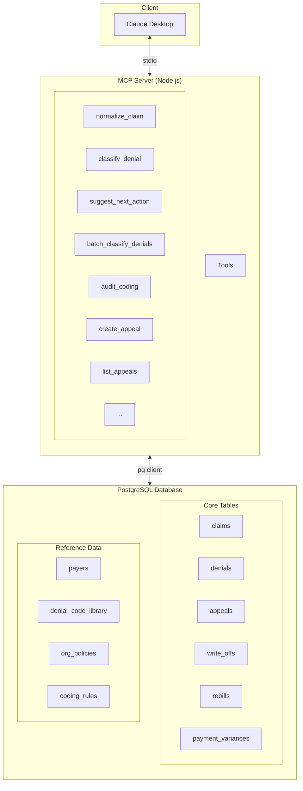
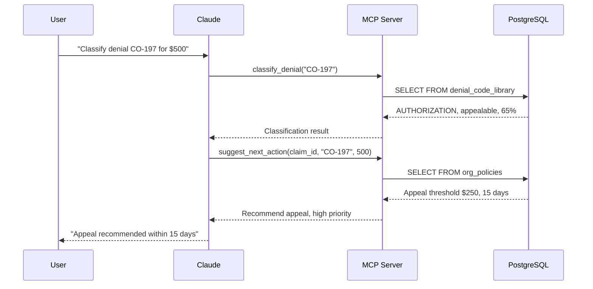

# RCM MCP Server

Model Context Protocol (MCP) server for Revenue Cycle Management operations.

## Table of Contents

- [Overview](#overview)
- [Setup](#setup)
  - [Prerequisites](#prerequisites)
  - [Build and Run](#build-and-run)
  - [Claude Desktop Integration](#claude-desktop-integration)
- [Available Tools](#available-tools)
  - [Claims Management](#claims-management)
  - [Denial Classification](#denial-classification)
  - [Appeals Management](#appeals-management)
  - [Write-offs](#write-offs)
  - [Rebills](#rebills)
  - [Payment Variances](#payment-variances)
- [Workflow Examples](#workflow-examples)
  - [Denial Triage](#denial-triage)
  - [Cash Leakage Analysis](#cash-leakage-analysis)
  - [Pre-Submission Validation](#pre-submission-validation)
  - [Appeals Workflow](#appeals-workflow)
  - [Write-off Workflow](#write-off-workflow)
  - [Rebill Workflow](#rebill-workflow)
  - [Payment Variance Workflow](#payment-variance-workflow)
- [Architecture](#architecture)
- [Customization](#customization)
- [Troubleshooting](#troubleshooting)

## Overview

This MCP server provides AI-powered tools for managing the complete healthcare revenue cycle:

- **Denial triage** - Classify denials and get policy-based recommendations
- **Cash leakage analysis** - Identify patterns and recovery opportunities
- **Pre-submission validation** - Catch coding errors before claims are submitted
- **Appeals management** - Track appeal lifecycle and success rates
- **Write-off tracking** - Monitor preventable write-offs
- **Rebill workflows** - Track corrections and recovery
- **Payment variance detection** - Identify underpayments by payer

## Setup

### Prerequisites

- Node.js 20+
- PostgreSQL database (see [Database Migrations](../migrations/README.md))
- Yarn 4.2.2 (managed via corepack)

### Build and Run

```bash
# Copy environment file
cp packages/mcp-server/.env.example packages/mcp-server/.env

# Build the server
yarn workspace @rcm/mcp-server build

# Start the server
yarn workspace @rcm/mcp-server start
```

For development with auto-rebuild:

```bash
yarn workspace @rcm/mcp-server dev
```

### Claude Desktop Integration

Add this configuration to your Claude Desktop config file:

**macOS:** `~/Library/Application Support/Claude/claude_desktop_config.json`

**Windows:** `%APPDATA%\Claude\claude_desktop_config.json`

```json
{
  "mcpServers": {
    "rcm": {
      "command": "node",
      "args": ["/absolute/path/to/rcm/packages/mcp-server/dist/index.js"]
    }
  }
}
```

After configuring, restart Claude Desktop and look for the MCP connection indicator.

**Test with seeded data:**

```
What denials do we have in the system? Classify them and suggest next actions.
```

## Available Tools

### Claims Management

| Tool | Description |
|------|-------------|
| `normalize_claim` | Normalize and validate claim data from various formats (837, 835, JSON) |
| `list_claims` | List claims with optional filters (patient, status) |
| `get_claim` | Retrieve claim details by ID |
| `update_claim_status` | Update claim status |

### Denial Classification

| Tool | Description |
|------|-------------|
| `classify_denial` | Classify denial code and get resolution guidance |
| `suggest_next_action` | Get policy-based recommendation (appeal, rebill, write-off) |
| `batch_classify_denials` | Analyze multiple denials for patterns and insights |
| `audit_coding` | Pre-submission coding validation |

### Appeals Management

| Tool | Description |
|------|-------------|
| `create_appeal` | Create appeal for a denied claim |
| `update_appeal` | Update appeal status, decision, payer response |
| `list_appeals` | Query appeals (status, priority, overdue, assignee) |
| `get_appeal_analytics` | Success rates, recovery metrics, insights |

### Write-offs

| Tool | Description |
|------|-------------|
| `create_write_off` | Write off uncollectible amount with preventability tracking |
| `list_write_offs` | Query write-offs (reason, category, preventability) |
| `get_write_off_analytics` | Preventable write-off analysis |

### Rebills

| Tool | Description |
|------|-------------|
| `create_rebill` | Create rebill after correcting denied claim |
| `update_rebill` | Update rebill status and resolution |
| `list_rebills` | Query rebills (status, reason, claim) |
| `get_rebill_analytics` | Success rates by correction type |

### Payment Variances

| Tool | Description |
|------|-------------|
| `create_payment_variance` | Track underpayments/overpayments |
| `update_payment_variance` | Update resolution, link to appeals |
| `list_payment_variances` | Query variances (type, payer, severity) |
| `get_payment_variance_analytics` | Payer patterns and contract compliance |

## Workflow Examples

The following examples use the seeded demo data from the migrations package.

### Denial Triage

**Scenario:** Classify the CO-197 denial on claim CLM-2024-001235 and get a recommendation.

**User prompt:**

```
We have a CO-197 denial for $500 on claim CLM-2024-001235. What should we do?
```

**What happens:**

1. `classify_denial` looks up CO-197 in the denial code library
   - Returns: AUTHORIZATION category, appealable, 65% success rate
2. `suggest_next_action` applies organization policies
   - Returns: Appeal recommended (amount exceeds $250 threshold), high priority, 15-day deadline

**Expected response:**

> This is an authorization denial (CO-197 - precertification absent). Based on your organization's policy, I recommend appealing within 15 days since the $500 amount exceeds the $250 threshold.

### Cash Leakage Analysis

**Scenario:** Analyze the seeded denials to identify patterns.

**User prompt:**

```
Analyze all our denials and identify where we're losing money.
```

**What happens:**

1. `batch_classify_denials` groups the seeded denials by category
   - CO-197 ($500) - Authorization
   - PR-1 ($15) - Patient responsibility
   - CO-4 ($250) - Coding error
   - CO-50 ($500) - Medical necessity

**Expected response:**

> Analysis of 4 denials totaling $1,265:
> - Authorization issues: 40% ($500) - CO-197 on claim CLM-2024-001235
> - Medical necessity: 40% ($500) - CO-50, requires clinical documentation
> - Coding errors: 20% ($250) - CO-4, modifier issue (already rebilled)
> - Patient responsibility: 1% ($15) - PR-1, written off per policy

### Pre-Submission Validation

**Scenario:** Validate a new claim before submission.

**User prompt:**

```
Check this claim before I submit it: patient PAT-007, CPT codes 99213 and 11055, diagnosis Z00.00, amount $200
```

**What happens:**

1. `audit_coding` checks against coding rules in the database
   - Warning: E/M 99213 with procedure needs modifier 25
   - Warning: Z00.00 is too general for medical necessity

**Expected response:**

> Found 2 issues before submission:
> 1. Add modifier 25 to 99213 when billing with a procedure on the same day
> 2. Z00.00 is too general - use a more specific diagnosis code
>
> Fix these to avoid denials like the CO-4 we had on CLM-2024-001237.

### Appeals Workflow

**Scenario:** Work with the existing appeal on the CO-197 denial.

**User prompt:**

```
Show me the status of our appeals and check if any are overdue.
```

**What happens:**

1. `list_appeals` retrieves appeals from the database
   - Appeal 850e8400... for denial 750e8400... (CO-197), status: submitted, priority: high
   - Appeal 850e8400...002 for CO-50 denial, status: pending

**Follow-up - Update appeal:**

```
The first appeal was approved for $450. Update it.
```

**What happens:**

1. `update_appeal` updates status to "approved", sets approved_amount to $450
2. System automatically marks the denial as resolved with recovered_amount $450

### Write-off Workflow

**Scenario:** Review the existing write-off.

**User prompt:**

```
Show me our write-offs and whether they were preventable.
```

**What happens:**

1. `list_write_offs` retrieves the seeded write-off
   - $15 write-off on PR-1 denial, reason: below_threshold, preventable: true
2. `get_write_off_analytics` shows preventability analysis

**Expected response:**

> You have 1 write-off totaling $15:
> - CLM-2024-001236: $15 written off (below $25 threshold)
> - This was marked as preventable - root cause was eligibility not verified at registration

### Rebill Workflow

**Scenario:** Check the status of the rebill for the CO-4 denial.

**User prompt:**

```
What's the status of our rebills?
```

**What happens:**

1. `list_rebills` retrieves the seeded rebill
   - Original claim CLM-2024-001237 denied for CO-4 (modifier error)
   - Rebill status: paid, recovered: $200
   - Correction: Added modifier 25 to 99213

**Expected response:**

> You have 1 rebill:
> - CLM-2024-001237 → CLM-2024-001567: Modifier 25 added
> - Status: Paid, recovered $200 of $250
> - This was a coding error (CO-4) that was successfully corrected

### Payment Variance Workflow

**Scenario:** Review the payment variance on the Medicare claim.

**User prompt:**

```
Do we have any underpayments we should look at?
```

**What happens:**

1. `list_payment_variances` retrieves the seeded variance
   - Claim CLM-2024-001890: Expected $500, received $425
   - Variance: -$75 (-15%), type: underpayment
   - Reason: Contract adjustment (wrong fee schedule applied)
   - Requires appeal: true

**Expected response:**

> Found 1 underpayment requiring attention:
> - CLM-2024-001890 (Medicare): Paid $425 instead of $500 (-15%)
> - Reason: Incorrect 2023 fee schedule applied instead of 2024 rates
> - Recommendation: Appeal this variance - it's a contract compliance issue

## Architecture



**Data Flow:**



For production deployment, see the [Infrastructure](../infrastructure/README.md) package.

## Customization

### Add Organization Policies

```sql
INSERT INTO org_policies (policy_name, policy_type, min_amount, days_to_action, auto_appeal)
VALUES ('High Value Appeals', 'appeal_threshold', 1000.00, 10, true);
```

### Add Payer-Specific Rules

```sql
INSERT INTO org_policies (policy_name, policy_type, payer_id, denial_category, min_amount, auto_appeal)
VALUES ('BCBS Auth Denials', 'appeal_threshold',
        (SELECT id FROM payers WHERE payer_id = 'BCBS-CA-001'),
        'AUTHORIZATION', 200.00, true);
```

### Add Coding Rules

```sql
INSERT INTO coding_rules (rule_name, rule_type, cpt_code, required_modifier, error_message, severity)
VALUES ('Custom Modifier Rule', 'modifier_required', '12345', 'XX', 'Requires modifier XX', 'warning');
```

## Troubleshooting

### Server Not Appearing in Claude Desktop

1. Check the config file path is correct
2. Use absolute paths (not relative)
3. Verify the server builds: `yarn workspace @rcm/mcp-server build`
4. Check Claude Desktop logs

### Database Connection Issues

1. Verify PostgreSQL is running: `docker ps | grep postgres`
2. Check DATABASE_URL in `.env` file
3. Ensure migrations have run: `yarn workspace @rcm/migrations migrate:up`
4. Test connectivity: `psql $DATABASE_URL -c "SELECT 1"`

### Missing Reference Data

If `classify_denial` returns "unknown code":

1. Verify migrations ran: `yarn workspace @rcm/migrations migrate:up`
2. Check denial_code_library table has data
3. Optionally run seed script: `yarn workspace @rcm/migrations seed`
